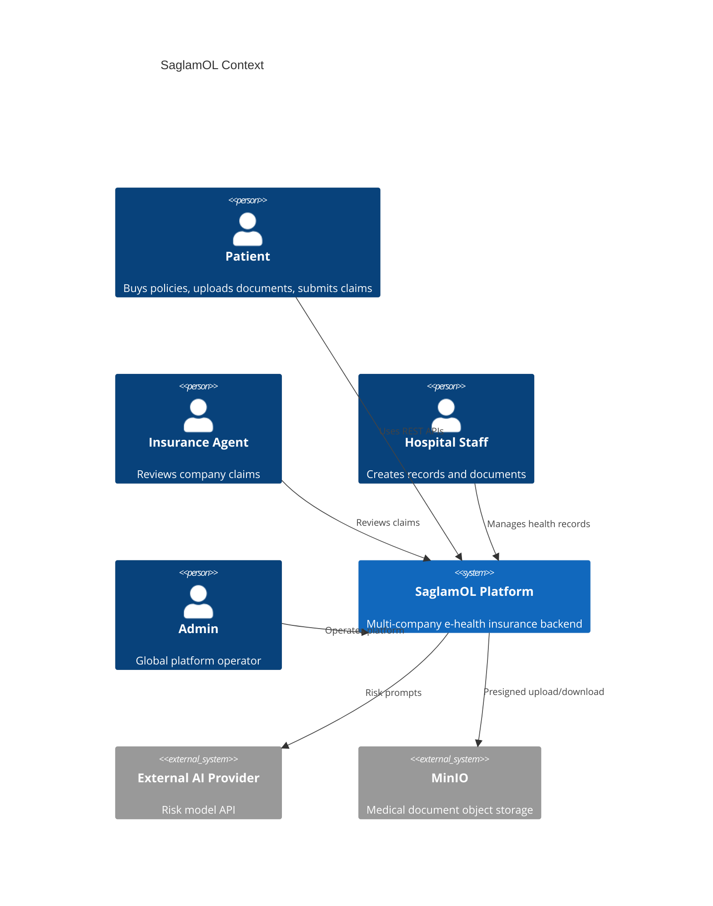
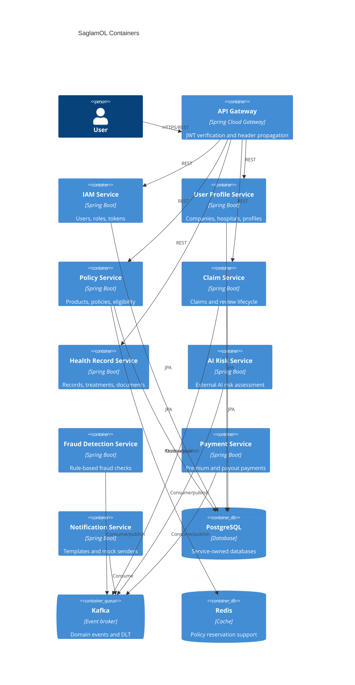
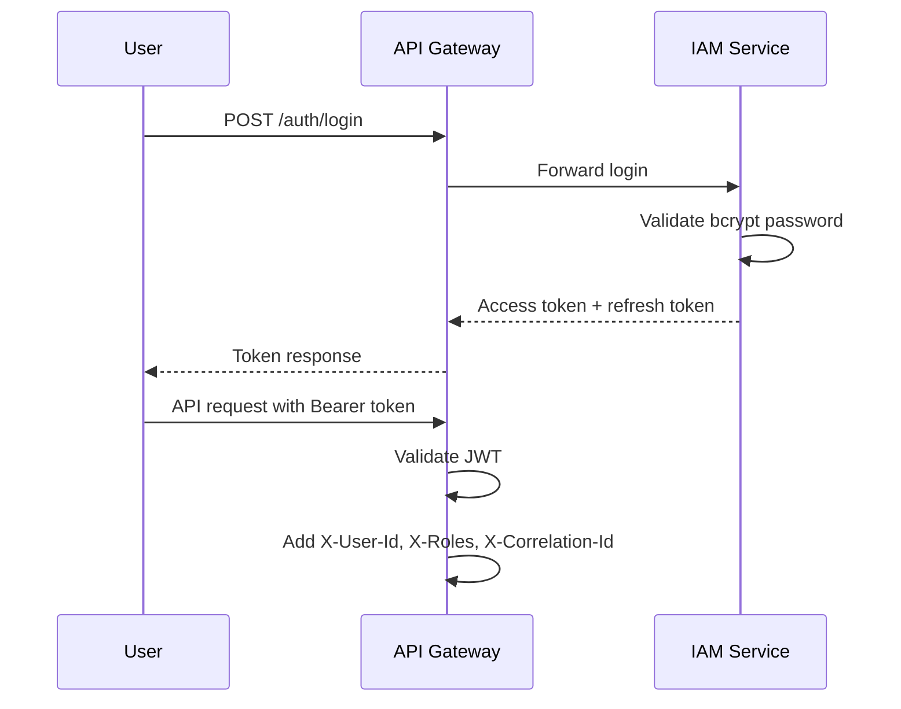
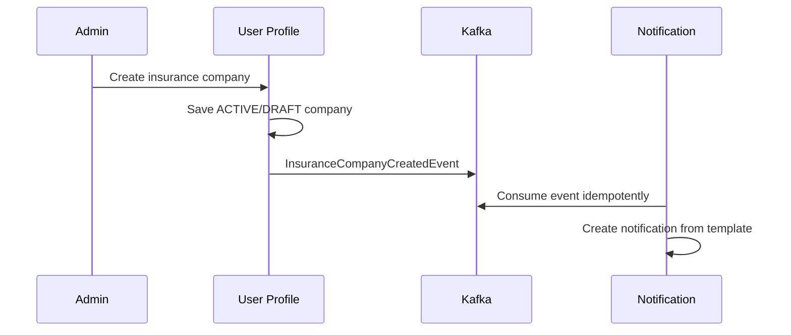
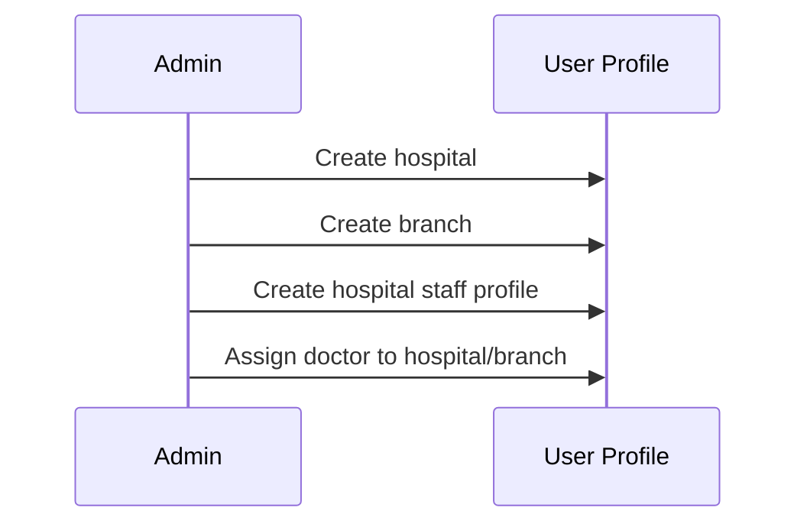
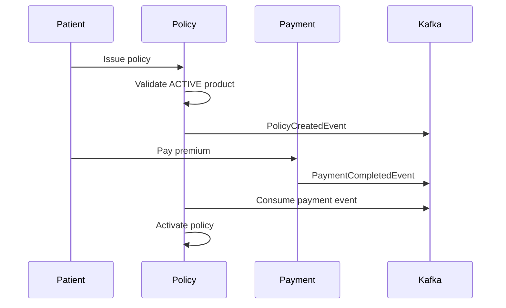
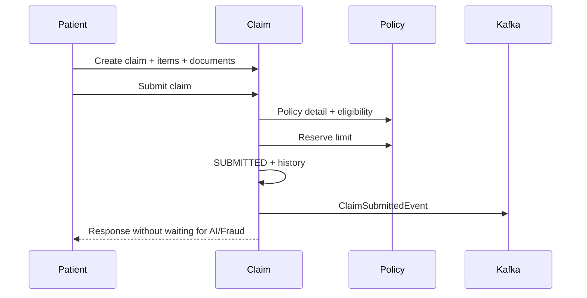
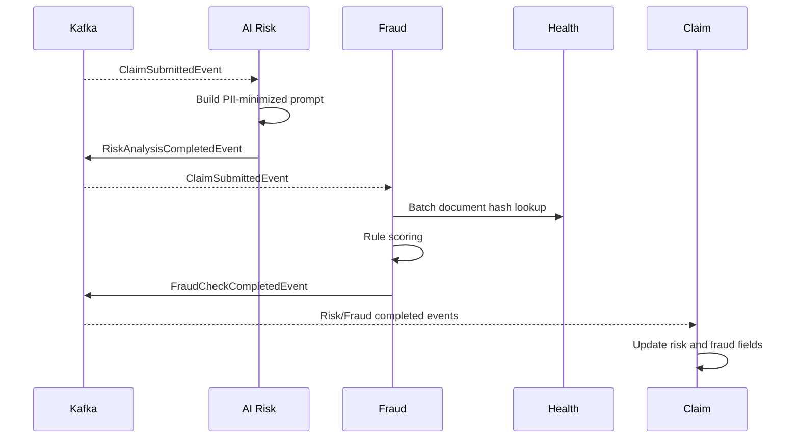
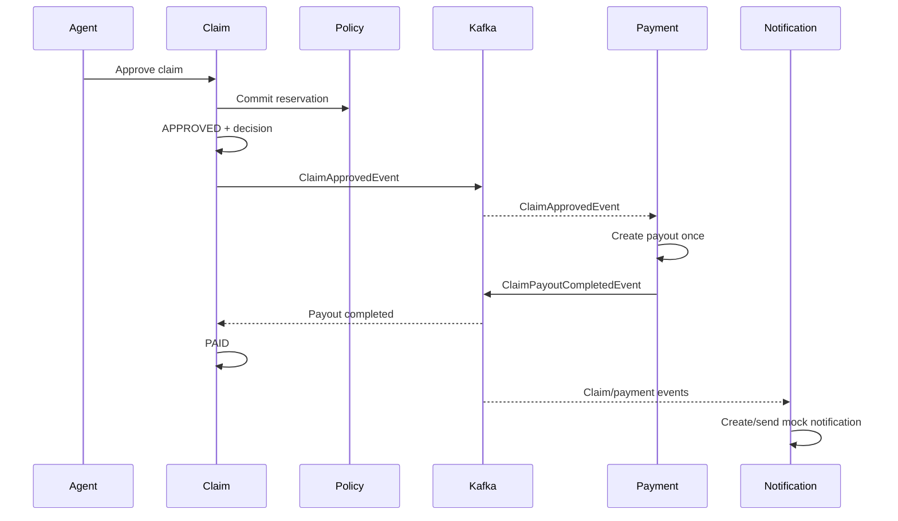

# SaglamOL Architecture

## C4 Context

## C4 Container

## Login Sequence

## Company Onboarding

## Hospital Onboarding

## Policy Purchase

## Claim Submit

## AI And Fraud Async

## Claim Approval, Payment And Notification

