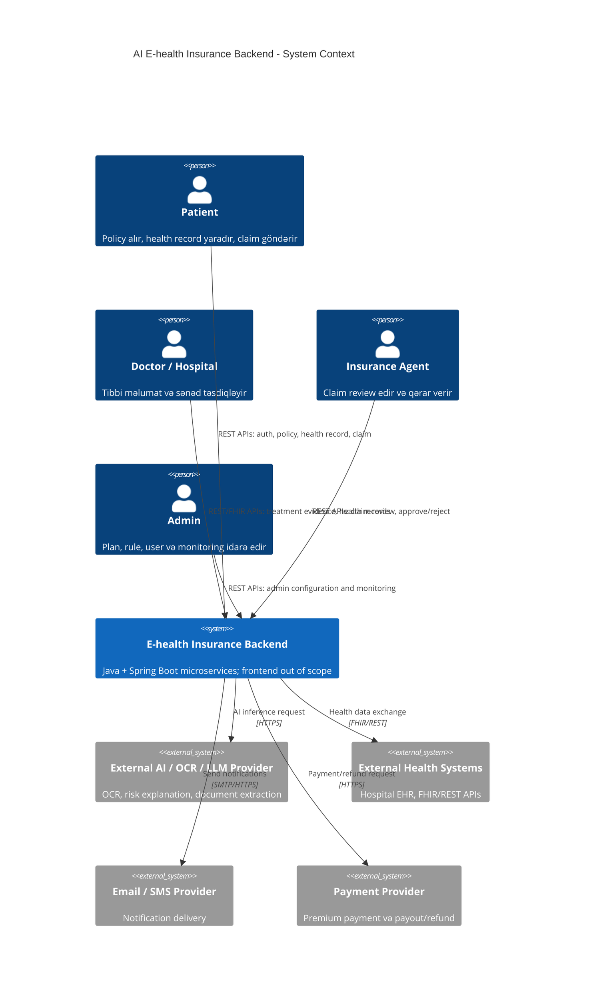
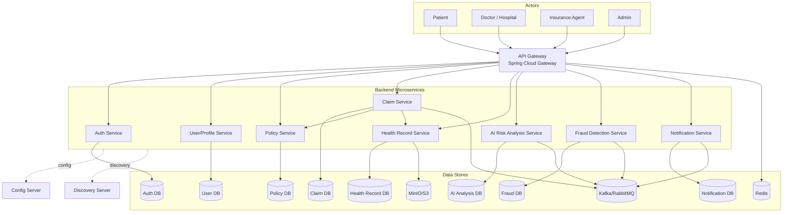
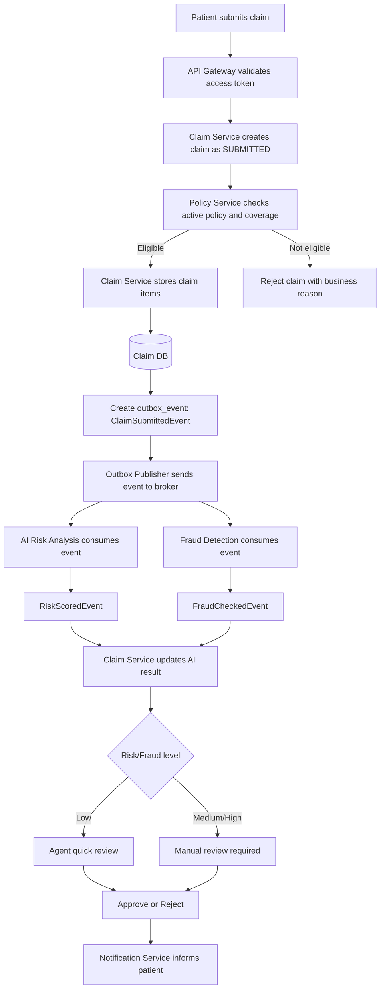
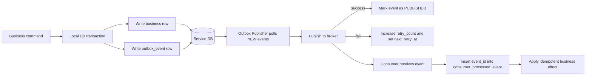

# AI E-health Insurance Backend - Codex Implementation Spec

Bu Markdown faylı əvvəl hazırlanmış backend PDF/DOCX sənədinin **Codex ilə project yaratmaq üçün optimallaşdırılmış** versiyasıdır. Frontend scope daxilində deyil. Məqsəd Codex-ə bu faylı verib Java 21 + Spring Boot 3.x microservices əsaslı backend monorepo hazırlatmaqdır.

## Codex üçün əsas icra qaydası

Codex bu sənədi oxuyaraq aşağıdakı nəticəni yaratmalıdır:

1. `e-health-insurance-platform/` adlı Gradle multi-module monorepo.
2. Backend-only microservices: `api-gateway`, `auth-service`, `user-profile-service`, `policy-service`, `claim-service`, `health-record-service`, `ai-risk-analysis-service`, `fraud-detection-service`, `notification-service`, `config-server`, `discovery-server`.
3. Hər servis üçün standart Spring Boot package structure: `controller`, `service`, `repository`, `dto`, `entity`, `mapper`, `config`, `exception`, `security`, `event`.
4. Database per service pattern: hər servis öz PostgreSQL DB/schema-sına sahib olmalıdır.
5. REST API-lər, DTO-lar, validation, exception handling, logging, Swagger/OpenAPI və Actuator endpoint-ləri.
6. Kafka/RabbitMQ event-driven communication üçün outbox pattern və idempotent consumer strukturu.
7. JWT/OAuth2 əsaslı security, RBAC, refresh token rotation və token reuse detection.
8. Docker Compose ilə local environment: PostgreSQL, Kafka/RabbitMQ, Redis, MinIO, Prometheus/Grafana.
9. Unit/integration test skeleton-ları və README-lər.

## Codex üçün tövsiyə olunan build ardıcıllığı

1. Root Gradle multi-module setup və common library-lər.
2. Config Server + Discovery Server + API Gateway.
3. Auth/User/Profile servis-ləri və security.
4. Policy + Claim servis-ləri və core business rules.
5. Health Record + Object Storage metadata flow.
6. AI Risk + Fraud Detection servis-ləri və async events.
7. Notification Service, Outbox Publisher və Consumer idempotency.
8. Docker Compose, observability və integration tests.

---


# Codex üçün əsas Mermaid diaqramları

Aşağıdakı diagramlar VS Code Markdown Preview Mermaid Support, GitHub və ya Mermaid Live Editor ilə render oluna bilər.

## C4 Level 1 - System Context



## C4 Level 2 - Container Diagram



## Claim Submission Flow



## Transactional Outbox Flow



---
**AI inteqrasiyalı E-health Insurance Layihəsi**

**Backend-only Software Architecture Document**

Java • Spring Boot • Microservices • AI Risk Analysis • Fraud Detection

| Scope: Bu sənəddə frontend hissəsi tamamilə çıxarılıb. Fokus yalnız backend servislər, sistem arxitekturası, C4 model diagramları, database/API dizaynı, MVP planı və 5 nəfərlik backend/system team iş bölgüsüdür. |
|---------------------------------------------------------------------------------------------------------------------------------------------------------------------------------------------------------------------|

| **Sənəd tipi**      | **Dəyər**                                                                                 |
|---------------------|-------------------------------------------------------------------------------------------|
| Layihə tipi         | E-health insurance backend platforması                                                    |
| Əsas texnologiyalar | Java 21, Spring Boot 3.x, Spring Cloud, PostgreSQL, Kafka/RabbitMQ, Docker, OpenTelemetry |
| AI sahəsi           | Risk scoring, fraud detection, document analysis üçün AI/ML/LLM inteqrasiyası             |
| Team modeli         | 5 nəfərlik backend/system development team                                                |
| Hazırlanma məqsədi  | Software engineering tələbəsi və real development team üçün praktiki layihə planı         |

# Mündəricat

1.  1\. Ümumi biznes məntiqi

2.  2\. Sistem arxitekturası

3.  3\. C4 Model formatında diaqramlar

4.  4\. Ümumi layihə flow-ları

5.  5\. Backend texniki dizayn

6.  6\. Database dizaynı

7.  7\. API dizaynı

8.  8\. MVP mərhələsi

9.  9\. 5 nəfərlik team üçün iş bölgüsü

10. 10\. Sprint və mərhələ planı

11. 11\. Layihənin təqdimat üçün qısa xülasəsi

12. 12\. Appendix: Mermaid diagram nümunələri

# 1. Ümumi biznes məntiqi

## 1.1 Layihənin məqsədi

Layihənin məqsədi Java, Spring Boot və mikroservis arxitekturası ilə
backend-only E-health insurance platforması qurmaqdır. Sistem patient,
doctor/hospital, insurance agent və admin rollarını dəstəkləyir; policy
management, claim submission, health record idarəsi, AI əsaslı risk
scoring və fraud detection proseslərini vahid backend ekosistemdə
birləşdirir.

## 1.2 Hansı problemi həll edir?

- Manual claim yoxlamasının uzun çəkməsi və agent yükünün çox olması.

- Policy coverage, limit, waiting period və exclusion qaydalarının
  manual yoxlanmasında səhv riski.

- Saxta invoice, təkrarlanan claim və şübhəli claim pattern-lərinin gec
  aşkarlanması.

- Health record, policy və claim məlumatlarının strukturlaşdırılmış
  şəkildə əlaqələndirilməməsi.

- Sığorta qərarlarının audit edilə bilməməsi və proses şəffaflığının
  zəif olması.

## 1.3 Əsas istifadəçilər və rollar

| **Rol**                 | **Sistemdə məqsədi**                                                      | **Əsas icazələr**                                                                             |
|-------------------------|---------------------------------------------------------------------------|-----------------------------------------------------------------------------------------------|
| Patient                 | Sığorta policy-si olan və claim yaradan şəxs                              | Öz profilini görmək, health record icazəli hissələrinə baxmaq, claim yaratmaq, status izləmək |
| Doctor / Hospital       | Patient-in tibbi məlumatını və treatment sübutlarını sistemə ötürən tərəf | Health record yaratmaq, medical evidence əlavə etmək, treatment doğrulamaq                    |
| Insurance Agent         | Claim-ləri review edən və qərar verən əməkdaş                             | Claim-ləri görmək, AI/Fraud nəticələrini oxumaq, approve/reject/need-more-info qərarı vermək  |
| Admin                   | Sistem qaydalarını və istifadəçiləri idarə edən şəxs                      | Plan/coverage yaratmaq, rolları idarə etmək, audit və monitoring izləmək                      |
| AI Risk Analysis Module | Claim riskini hesablamaq və izahlı nəticə vermək                          | Claim/Policy/Health data əsasında riskScore, riskLevel, reasons yaratmaq                      |
| External Health Systems | Hospital/EHR/FHIR sistemləri                                              | Treatment və health data inteqrasiyası üçün xarici mənbə                                      |

## 1.4 Əsas biznes prosesləri

| **Proses**               | **Qısa izah**                                                        | **Əsas servislər**                    |
|--------------------------|----------------------------------------------------------------------|---------------------------------------|
| Registration/Login       | İstifadəçi qeydiyyatı, login, JWT token və role-based access         | Auth, User/Profile, API Gateway       |
| Policy Management        | Insurance plan, coverage rule, policy lifecycle və eligibility check | Policy, Claim                         |
| Health Record Management | Patient medical record, diagnosis, treatment, attachment metadata    | Health Record, User/Profile           |
| Claim Submission         | Patient claim yaradır, policy və health data ilə əlaqələndirilir     | Claim, Policy, Health Record          |
| AI Risk Scoring          | Claim üçün risk score, confidence və izah yaradılır                  | AI Risk Analysis, Claim               |
| Fraud Detection          | Duplicate, anomaly, suspicious timing və document hash yoxlaması     | Fraud Detection, Claim, Health Record |
| Claim Decision           | Agent AI/Fraud nəticələrinə baxıb approve/reject edir                | Claim, Notification                   |
| Notification             | Status dəyişiklikləri email/SMS/in-app event kimi göndərilir         | Notification, Message Broker          |

## 1.5 Claim, policy, health data, risk scoring və fraud prosesləri

| **Sahə**            | **Biznes məntiqi**                                                                                      | **Qərar qaydaları**                                                                                         |
|---------------------|---------------------------------------------------------------------------------------------------------|-------------------------------------------------------------------------------------------------------------|
| Insurance Claim     | Patient tibbi xərc və medical evidence əsasında claim yaradır. Claim status lifecycle ilə idarə olunur. | Active policy olmalıdır; serviceType coverage daxilində olmalıdır; sənəd və health record uyğun gəlməlidir. |
| Policy Management   | Plan, coverage, limit, waitingPeriod, exclusion və policy status-ları saxlanılır.                       | Policy ACTIVE deyilsə claim qəbul edilmir; annual limit aşılırsa partial/reject qərarı verilə bilər.        |
| Patient Health Data | Doctor/Hospital tərəfindən yaradılan health record claim üçün sübut kimi istifadə olunur.               | Health data yalnız aidiyyəti servislər vasitəsilə oxunur; birbaşa DB paylaşımı yoxdur.                      |
| Risk Scoring        | AI claim amount, policy age, health context və previous claim pattern əsasında risk hesablayır.         | AI son qərar vermir; risk nəticəsi agent üçün decision support rolundadır.                                  |
| Fraud Detection     | Rule + anomaly yanaşması ilə duplicate invoice, suspicious provider, unusual amount yoxlanılır.         | High fraud signal olduqda claim manual review statusuna keçirilir.                                          |

## 1.6 MVP scope

| **MVP-də olmalıdır**                                                                       | **Sonrakı mərhələyə saxlanılır**                                                                      |
|--------------------------------------------------------------------------------------------|-------------------------------------------------------------------------------------------------------|
| Auth, User/Profile, Policy, Claim, Health Record, basic AI Risk, basic Fraud, Notification | Payment integration, advanced AI model training, full FHIR interoperability, admin dashboard frontend |
| JWT security, RBAC, database per service, basic Kafka events                               | Advanced SSO/OAuth provider, real-time streaming dashboards, production Kubernetes hardening          |
| Swagger/OpenAPI ilə backend API-lərin test olunması                                        | Mobile/Web frontend, public patient portal, complex reporting UI                                      |
| Docker Compose ilə local deployment                                                        | Cloud production deployment, multi-region setup, advanced disaster recovery                           |

# 2. Sistem arxitekturası

## 2.1 Backend-only arxitektura izahı

Bu arxitekturada frontend ayrıca scope-dan çıxarılıb. Sistem yalnız
backend servislər, API Gateway, service discovery, centralized config,
data stores, message broker, monitoring və external integrations
üzərində qurulur. Test və demo üçün API-lər Swagger/OpenAPI, Postman və
ya automated integration test-lərlə istifadə olunur.

## 2.2 Java + Spring Boot mikroservis yanaşması

- Hər biznes domain ayrıca Spring Boot microservice kimi deploy olunur.

- Hər service öz database-indən məsuldur; başqa servisin database-inə
  birbaşa qoşulmur.

- Synchronous communication REST API ilə, asynchronous communication isə
  message broker ilə aparılır.

- Cross-cutting concerns: security, logging, tracing, validation,
  exception handling, monitoring və configuration standartlaşdırılır.

## 2.3 Service-lərin siyahısı və məsuliyyətləri

| **Service**              | **Əsas məsuliyyətlər**                                          | **Data ownership**                             |
|--------------------------|-----------------------------------------------------------------|------------------------------------------------|
| API Gateway              | Routing, JWT validation, rate limiting, request correlation     | DB yoxdur; Redis rate-limit metadata ola bilər |
| Config Server            | Centralized application configuration                           | Git/config repository                          |
| Discovery Server         | Service registry və dynamic service discovery                   | In-memory registry                             |
| Auth Service             | Register, login, JWT, refresh token, roles, permissions         | Auth DB                                        |
| User/Profile Service     | Patient, doctor, agent, admin business profile                  | User DB                                        |
| Policy Service           | Insurance plan, coverage rule, policy lifecycle, eligibility    | Policy DB                                      |
| Claim Service            | Claim submission, status lifecycle, decision, claim history     | Claim DB                                       |
| Health Record Service    | Patient health records, treatment, diagnosis, evidence metadata | Health Record DB + Object Storage              |
| AI Risk Analysis Service | Risk scoring, explanation, AI inference orchestration           | AI Analysis DB                                 |
| Fraud Detection Service  | Fraud rules, anomaly checks, duplicate document detection       | Fraud Detection DB                             |
| Notification Service     | Email/SMS/in-app notification, template, retry                  | Notification DB                                |

## 2.4 Database seçimi və data ownership

Əsas relational məlumatlar üçün PostgreSQL seçilir. File content
database-də saxlanmır; Health Record Service document metadata-nı
saxlayır, real fayl MinIO/S3-də yerləşir. Data ownership prinsipinə görə
hər service yalnız öz data modelini dəyişə bilər. Digər service-lər data
almaq üçün REST API və ya event-lərdən istifadə edir.

## 2.5 Sync və async communication

| **Communication tipi** | **Harada istifadə olunur**                      | **Nümunə**                                                   |
|------------------------|-------------------------------------------------|--------------------------------------------------------------|
| Synchronous REST       | Dərhal cavab tələb edən query və validation-lar | Claim Service -> Policy Service eligibility check           |
| Asynchronous Event     | Uzun proseslər və side effect-lər               | ClaimSubmittedEvent -> AI Risk, Fraud, Notification         |
| External API           | 3rd party sistemlərlə inteqrasiya               | Health Record -> External FHIR API, AI Risk -> LLM/OCR API |

## 2.6 Security, authentication, authorization və privacy

- Authentication: Auth Service JWT access token və refresh token verir.

- Authorization: Role-based access control - PATIENT, DOCTOR, AGENT,
  ADMIN, SYSTEM.

- Service-to-service: internal token, mTLS və ya gateway-to-service
  trust modeli nəzərə alınır.

- Data privacy: health data minimum exposure prinsipi ilə yalnız lazım
  olan servislərə verilir.

- Audit: login, role change, claim decision, health record access kimi
  action-lar audit edilir.

# 3. C4 Model formatında diaqramlar - oxunaqlı versiya

Bu versiyada diaqramlar landscape səhifələrə yerləşdirilib, node-lar
böyüdülüb və hər diaqram ayrıca səhifəyə ayrılıb. Məqsəd: PDF-də zoom
etmədən əsas servis əlaqələrini oxumaq.

**Level 1: System Context Diagram**


> Diagram source is provided as Mermaid in the relevant section or Appendix.


İzah: Sistem patient, doctor/hospital, insurance agent və admin rolları
ilə əlaqədədir. Xarici tərəflər kimi External Health Systems, AI/OCR/LLM
Provider, Notification Provider və Payment Provider göstərilir.

**Level 2: Container Diagram**


> Diagram source is provided as Mermaid in the relevant section or Appendix.


İzah: API Gateway, Config Server, Discovery Server, mikroservislər,
database per service, message broker, object storage və monitoring
komponentləri backend-only arxitekturanın əsas container-ləridir.

## 3.1 Level 3 Component Diagram-lar

**Claim Service Component Diagram**


> Diagram source is provided as Mermaid in the relevant section or Appendix.


Claim Service claim lifecycle-in əsas orchestration nöqtəsidir:
eligibility, document link, AI risk result, fraud result, decision və
event publish bu servisdə idarə olunur.

**Policy Service Component Diagram**


> Diagram source is provided as Mermaid in the relevant section or Appendix.


Policy Service plan, coverage rule, eligibility və policy lifecycle üçün
cavabdehdir.

**AI Risk Analysis Service Component Diagram**


> Diagram source is provided as Mermaid in the relevant section or Appendix.


AI Risk Analysis Service risk score, explanation və external AI adapter
hissələrini idarə edir.

**Fraud Detection Service Component Diagram**


> Diagram source is provided as Mermaid in the relevant section or Appendix.


Fraud Detection Service duplicate document, suspicious timing və anomaly
rule-ları ilə claim-i yoxlayır.

## 3.2 Level 4 Code-level structure

Hər Spring Boot microservice üçün standart package strukturu aşağıdakı
kimi olmalıdır:

service-name/

src/main/java/com/ehealth/{service}/

controller/ REST controllers, request entry points

service/ application services and business use cases

repository/ Spring Data JPA repositories

dto/ request/response/internal DTO classes

entity/ JPA entities owned by this service

mapper/ entity \<-> DTO mapping

config/ security, OpenAPI, Kafka, datasource config

exception/ domain exceptions and global handlers

security/ method security, role checks, token helpers

event/ producers, consumers, event payloads

src/main/resources/

application.yml

db/changelog/ Liquibase migration files

Dockerfile

build.gradle

| **Package** | **Məqsəd**                 | **Qayda**                                          |
|-------------|----------------------------|----------------------------------------------------|
| controller  | HTTP endpoint-lər          | Business logic yazılmamalıdır                      |
| service     | Use-case və business rules | Transaction boundary əsasən burada olur            |
| repository  | DB query-lər               | Başqa service DB-nə qoşulmamalıdır                 |
| dto         | API contract               | Entity birbaşa API response kimi çıxmamalıdır      |
| entity      | Service-owned data model   | Yalnız həmin service-in database-i üçün            |
| mapper      | DTO/entity dönüşümü        | Manual mapper və ya MapStruct istifadə edilə bilər |
| event       | Kafka/RabbitMQ event-ləri  | Event schema versioning nəzərə alınmalıdır         |

# 4. Ümumi layihə flow-ları

## User registration və login flow

**User registration və login flow**


> Diagram source is provided as Mermaid in the relevant section or Appendix.


Auth Service input validation və credential check edir; Auth DB istifadə
olunur; UserRegisteredEvent/LoginEvent publish oluna bilər; credential
səhvdirsə rollback yox, 401 response qaytarılır.

| **Addım** | **Service**         | **Database/Event**     | **Error/Rollback**            |
|-----------|---------------------|------------------------|-------------------------------|
| 1         | API Gateway         | Request correlation ID | Invalid token -> 401         |
| 2         | Domain service      | Own DB only            | Validation error -> 400      |
| 3         | Related service/API | REST or event          | Timeout -> retry/fallback    |
| 4         | Message broker      | Domain event           | Publish fail -> outbox/retry |

## Patient health record creation flow

**Patient health record creation flow**


> Diagram source is provided as Mermaid in the relevant section or Appendix.


Health Record Service patient və doctor/hospital icazəsini yoxlayır;
Health Record DB və Object Storage istifadə olunur;
HealthRecordCreatedEvent publish olunur; file storage error olarsa DB
transaction rollback edilir.

| **Addım** | **Service**         | **Database/Event**     | **Error/Rollback**            |
|-----------|---------------------|------------------------|-------------------------------|
| 1         | API Gateway         | Request correlation ID | Invalid token -> 401         |
| 2         | Domain service      | Own DB only            | Validation error -> 400      |
| 3         | Related service/API | REST or event          | Timeout -> retry/fallback    |
| 4         | Message broker      | Domain event           | Publish fail -> outbox/retry |

## Insurance policy creation flow

**Insurance policy creation flow**


> Diagram source is provided as Mermaid in the relevant section or Appendix.


Policy Service plan, coverage və limitləri saxlayır; Policy DB istifadə
olunur; PolicyCreated/PolicyActivatedEvent publish olunur; qayda
conflict-i olarsa transaction rollback edilir.

| **Addım** | **Service**         | **Database/Event**     | **Error/Rollback**            |
|-----------|---------------------|------------------------|-------------------------------|
| 1         | API Gateway         | Request correlation ID | Invalid token -> 401         |
| 2         | Domain service      | Own DB only            | Validation error -> 400      |
| 3         | Related service/API | REST or event          | Timeout -> retry/fallback    |
| 4         | Message broker      | Domain event           | Publish fail -> outbox/retry |

## Claim submission flow

**Claim submission flow**


> Diagram source is provided as Mermaid in the relevant section or Appendix.


Claim Service claim-i yaradır, Policy Service eligibility, Health Record
Service medical evidence yoxlayır; Claim DB istifadə olunur;
ClaimSubmittedEvent publish edilir; active policy yoxdursa claim reject
edilir.

| **Addım** | **Service**         | **Database/Event**     | **Error/Rollback**            |
|-----------|---------------------|------------------------|-------------------------------|
| 1         | API Gateway         | Request correlation ID | Invalid token -> 401         |
| 2         | Domain service      | Own DB only            | Validation error -> 400      |
| 3         | Related service/API | REST or event          | Timeout -> retry/fallback    |
| 4         | Message broker      | Domain event           | Publish fail -> outbox/retry |

## Claim approval/rejection flow

**Claim approval/rejection flow**


> Diagram source is provided as Mermaid in the relevant section or Appendix.


Agent Claim Service üzərindən qərar verir; Claim DB status history
saxlayır; ClaimApproved/Rejected/MoreInfoRequested event-ləri publish
edilir; invalid status transition olarsa 409 Conflict qaytarılır.

| **Addım** | **Service**         | **Database/Event**     | **Error/Rollback**            |
|-----------|---------------------|------------------------|-------------------------------|
| 1         | API Gateway         | Request correlation ID | Invalid token -> 401         |
| 2         | Domain service      | Own DB only            | Validation error -> 400      |
| 3         | Related service/API | REST or event          | Timeout -> retry/fallback    |
| 4         | Message broker      | Domain event           | Publish fail -> outbox/retry |

## AI-based risk scoring flow

**AI-based risk scoring flow**


> Diagram source is provided as Mermaid in the relevant section or Appendix.


AI Risk Analysis Service event consume edir, feature yaradır, external
AI/ML model çağırır; AI Analysis DB istifadə olunur; RiskScoredEvent
publish edilir; AI timeout olarsa manual review fallback olur.

| **Addım** | **Service**         | **Database/Event**     | **Error/Rollback**            |
|-----------|---------------------|------------------------|-------------------------------|
| 1         | API Gateway         | Request correlation ID | Invalid token -> 401         |
| 2         | Domain service      | Own DB only            | Validation error -> 400      |
| 3         | Related service/API | REST or event          | Timeout -> retry/fallback    |
| 4         | Message broker      | Domain event           | Publish fail -> outbox/retry |

## Fraud detection flow

**Fraud detection flow**


> Diagram source is provided as Mermaid in the relevant section or Appendix.


Fraud Detection Service rule və anomaly checks icra edir; Fraud DB
istifadə olunur; FraudChecked/FraudFlaggedEvent publish edilir;
duplicate invoice və suspicious pattern varsa high-risk flag yaranır.

| **Addım** | **Service**         | **Database/Event**     | **Error/Rollback**            |
|-----------|---------------------|------------------------|-------------------------------|
| 1         | API Gateway         | Request correlation ID | Invalid token -> 401         |
| 2         | Domain service      | Own DB only            | Validation error -> 400      |
| 3         | Related service/API | REST or event          | Timeout -> retry/fallback    |
| 4         | Message broker      | Domain event           | Publish fail -> outbox/retry |

## Notification sending flow

**Notification sending flow**


> Diagram source is provided as Mermaid in the relevant section or Appendix.


Notification Service domain event consume edir, template tətbiq edir,
Email/SMS provider çağırır; Notification DB status və retry saxlayır;
provider error olarsa retry queue işləyir.

| **Addım** | **Service**         | **Database/Event**     | **Error/Rollback**            |
|-----------|---------------------|------------------------|-------------------------------|
| 1         | API Gateway         | Request correlation ID | Invalid token -> 401         |
| 2         | Domain service      | Own DB only            | Validation error -> 400      |
| 3         | Related service/API | REST or event          | Timeout -> retry/fallback    |
| 4         | Message broker      | Domain event           | Publish fail -> outbox/retry |

## Admin monitoring flow

**Admin monitoring flow**


> Diagram source is provided as Mermaid in the relevant section or Appendix.


Admin monitoring data-nı Actuator, Prometheus, Grafana, logs və audit
data əsasında izləyir; threshold pozulanda alert yaranır.

| **Addım** | **Service**         | **Database/Event**     | **Error/Rollback**            |
|-----------|---------------------|------------------------|-------------------------------|
| 1         | API Gateway         | Request correlation ID | Invalid token -> 401         |
| 2         | Domain service      | Own DB only            | Validation error -> 400      |
| 3         | Related service/API | REST or event          | Timeout -> retry/fallback    |
| 4         | Message broker      | Domain event           | Publish fail -> outbox/retry |

# 5. Backend texniki dizayn

## Spring Boot microservices structure

Hər service müstəqil Spring Boot app, ayrıca build.gradle, Dockerfile və
database migration-ları ilə yaradılır. Common code minimum saxlanılır;
yalnız common exception, common events və security helper kimi stabil
kitabxanalar paylaşılır.

## API Gateway routing

Gateway /api/v1/auth/\*\*, /api/v1/users/\*\*, /api/v1/policies/\*\*,
/api/v1/claims/\*\*, /api/v1/health-records/\*\*, /api/v1/ai-risk/\*\*,
/api/v1/fraud/\*\* və /api/v1/notifications/\*\* path-lərini uyğun
servislərə yönləndirir.

## Service discovery

Discovery Server vasitəsilə servislər register olunur. Gateway və
service clients static URL əvəzinə service name ilə çağırış edə bilər.

## Centralized configuration

Config Server database URL, Kafka topic, JWT public key, retry config və
feature flag kimi environment-dependent config-ləri mərkəzdən verir.

## Database per service pattern

Hər service öz DB-sinə sahibdir. Cross-service join yoxdur. Məlumat
lazım olduqda API çağırışı, cached read model və ya event-driven
projection istifadə edilir.

## DTO və entity ayrımı

Entity database modelidir, DTO API contract-dır. Entity-ni birbaşa
expose etmək security və coupling riskidir.

## Validation

Bean Validation annotasiyaları (@NotNull, @Email, @Size, @Positive) və
domain-level validator-lar birlikdə istifadə olunur.

## Exception handling

@RestControllerAdvice ilə standart error response qaytarılır: timestamp,
status, errorCode, message, path, correlationId.

## Logging

Structured JSON logging, correlationId, userId, claimId kimi context
field-ləri ilə aparılır. Sensitive health data log-a yazılmamalıdır.

## Monitoring

Spring Boot Actuator metrics Prometheus tərəfindən scrape edilir;
Grafana dashboard-lar error rate, latency, Kafka lag, DB connections
göstərir.

## Distributed tracing

OpenTelemetry traceId/spanId service-lər arası request və event
flow-larını izləməyə kömək edir.

## Security with JWT/OAuth2

MVP-də JWT əsaslı Auth Service kifayətdir. Gələcəkdə OAuth2/OIDC
provider əlavə oluna bilər.

## Role-based access control

PATIENT yalnız öz data-sını, DOCTOR icazəli health record-ları, AGENT
claim review-ları, ADMIN bütün admin əməliyyatlarını icra edir.

## API versioning

Bütün endpoint-lər /api/v1 ilə başlayır. Breaking change üçün /api/v2
yaradılır.

## Transaction management

Hər service daxilində local transaction istifadə olunur. Cross-service
transaction yoxdur.

## Saga pattern və eventual consistency

Claim submission -> risk scoring -> fraud detection -> notification
kimi proseslər event-driven saga ilə idarə edilir. Bir addım fail olarsa
compensating action və ya manual review statusu istifadə edilir.

## Message broker async communication

Kafka/RabbitMQ domain event-ləri daşıyır. Event-lər idempotent consumer,
retry və dead-letter queue strategiyası ilə işlənməlidir.

## Docker və deployment strukturu

Local MVP Docker Compose ilə; production üçün Kubernetes namespace-ləri:
gateway, services, data, observability. Hər service üçün healthcheck və
resource limits verilməlidir.

# 6. Database dizaynı

## Auth DB

| **Entity/Table** | **Əsas field-lər**                                          |
|------------------|-------------------------------------------------------------|
| user_account     | id, email, password_hash, status, created_at, last_login_at |
| role             | id, code, name                                              |
| permission       | id, code, description                                       |
| user_role        | user_id, role_id                                            |
| refresh_token    | id, user_id, token_hash, expires_at, revoked                |

Relationship yanaşması: service daxilində foreign key istifadə oluna
bilər. Başqa service-in entity-si üçün real FK yaradılmır; yalnız
external id saxlanılır. Məsələn Claim DB-də patient_id və policy_id
saxlanılsa da, User DB və Policy DB-yə FK constraint qoyulmur.

## User DB

| **Entity/Table** | **Əsas field-lər**                                       |
|------------------|----------------------------------------------------------|
| patient_profile  | id, user_id, first_name, last_name, date_of_birth, phone |
| doctor_profile   | id, user_id, license_no, hospital_id, specialty          |
| agent_profile    | id, user_id, employee_no, department                     |
| address          | id, owner_id, owner_type, city, line1                    |

Relationship yanaşması: service daxilində foreign key istifadə oluna
bilər. Başqa service-in entity-si üçün real FK yaradılmır; yalnız
external id saxlanılır. Məsələn Claim DB-də patient_id və policy_id
saxlanılsa da, User DB və Policy DB-yə FK constraint qoyulmur.

## Policy DB

| **Entity/Table**   | **Əsas field-lər**                                                             |
|--------------------|--------------------------------------------------------------------------------|
| insurance_plan     | id, code, name, status, monthly_price                                          |
| coverage_rule      | id, plan_id, service_type, coverage_percent, annual_limit, waiting_period_days |
| policy             | id, patient_id, plan_id, status, start_date, end_date                          |
| policy_limit_usage | id, policy_id, service_type, used_amount                                       |

Relationship yanaşması: service daxilində foreign key istifadə oluna
bilər. Başqa service-in entity-si üçün real FK yaradılmır; yalnız
external id saxlanılır. Məsələn Claim DB-də patient_id və policy_id
saxlanılsa da, User DB və Policy DB-yə FK constraint qoyulmur.

## Claim DB

| **Entity/Table**     | **Əsas field-lər**                                                      |
|----------------------|-------------------------------------------------------------------------|
| claim                | id, patient_id, policy_id, status, claim_type, total_amount, created_at |
| claim_item           | id, claim_id, service_type, amount, service_date                        |
| claim_decision       | id, claim_id, decision, decided_by, reason                              |
| claim_status_history | id, claim_id, old_status, new_status, changed_at                        |

Relationship yanaşması: service daxilində foreign key istifadə oluna
bilər. Başqa service-in entity-si üçün real FK yaradılmır; yalnız
external id saxlanılır. Məsələn Claim DB-də patient_id və policy_id
saxlanılsa da, User DB və Policy DB-yə FK constraint qoyulmur.

## Health Record DB

| **Entity/Table**  | **Əsas field-lər**                                        |
|-------------------|-----------------------------------------------------------|
| health_record     | id, patient_id, doctor_id, diagnosis_code, treatment_date |
| treatment         | id, health_record_id, service_type, description           |
| medical_document  | id, health_record_id, file_name, storage_path, hash       |
| health_access_log | id, record_id, actor_id, action, created_at               |

Relationship yanaşması: service daxilində foreign key istifadə oluna
bilər. Başqa service-in entity-si üçün real FK yaradılmır; yalnız
external id saxlanılır. Məsələn Claim DB-də patient_id və policy_id
saxlanılsa da, User DB və Policy DB-yə FK constraint qoyulmur.

## AI Analysis DB

| **Entity/Table** | **Əsas field-lər**                                              |
|------------------|-----------------------------------------------------------------|
| risk_analysis    | id, claim_id, risk_score, risk_level, confidence, model_version |
| risk_reason      | id, analysis_id, reason_code, description                       |
| ai_request_log   | id, claim_id, provider, latency_ms, status                      |

Relationship yanaşması: service daxilində foreign key istifadə oluna
bilər. Başqa service-in entity-si üçün real FK yaradılmır; yalnız
external id saxlanılır. Məsələn Claim DB-də patient_id və policy_id
saxlanılsa da, User DB və Policy DB-yə FK constraint qoyulmur.

## Fraud Detection DB

| **Entity/Table**    | **Əsas field-lər**                                     |
|---------------------|--------------------------------------------------------|
| fraud_check         | id, claim_id, fraud_score, status, checked_at          |
| fraud_signal        | id, fraud_check_id, signal_type, severity, description |
| document_hash_index | id, document_hash, first_claim_id, seen_count          |

Relationship yanaşması: service daxilində foreign key istifadə oluna
bilər. Başqa service-in entity-si üçün real FK yaradılmır; yalnız
external id saxlanılır. Məsələn Claim DB-də patient_id və policy_id
saxlanılsa da, User DB və Policy DB-yə FK constraint qoyulmur.

## Notification DB

| **Entity/Table**      | **Əsas field-lər**                                          |
|-----------------------|-------------------------------------------------------------|
| notification          | id, recipient_user_id, channel, status, subject, created_at |
| notification_template | id, code, channel, body                                     |
| notification_retry    | id, notification_id, retry_count, next_retry_at             |

Relationship yanaşması: service daxilində foreign key istifadə oluna
bilər. Başqa service-in entity-si üçün real FK yaradılmır; yalnız
external id saxlanılır. Məsələn Claim DB-də patient_id və policy_id
saxlanılsa da, User DB və Policy DB-yə FK constraint qoyulmur.

| Paylaşılmamalı data: password_hash, refresh_token, full medical details, raw AI prompts, document file path və şəxsi health data başqa servislərə birbaşa DB yolu ilə açılmamalıdır. Lazım olan minimal məlumat API/event contract vasitəsilə ötürülməlidir. |
|--------------------------------------------------------------------------------------------------------------------------------------------------------------------------------------------------------------------------------------------------------------|

# 7. API dizaynı

## Auth APIs

| **Method** | **URL**               | **Role** | **Status** | **Request body nümunəsi**                                     | **Response body nümunəsi**                   |
|------------|-----------------------|----------|------------|---------------------------------------------------------------|----------------------------------------------|
| POST       | /api/v1/auth/register | PUBLIC   | 201        | {"email":"ali@mail.com","password":"\*\*\*","role":"PATIENT"} | {"userId":"USR-1","status":"CREATED"}        |
| POST       | /api/v1/auth/login    | PUBLIC   | 200/401    | {"email":"ali@mail.com","password":"\*\*\*"}                  | {"accessToken":"jwt","refreshToken":"token"} |
| POST       | /api/v1/auth/refresh  | PUBLIC   | 200/401    | {"refreshToken":"token"}                                      | {"accessToken":"new-jwt"}                    |
| GET        | /api/v1/auth/me       | ANY_AUTH | 200        | -                                                            | {"userId":"USR-1","roles":["PATIENT"]}     |

## User APIs

| **Method** | **URL**                     | **Role**            | **Status** | **Request body nümunəsi**            | **Response body nümunəsi**              |
|------------|-----------------------------|---------------------|------------|--------------------------------------|-----------------------------------------|
| POST       | /api/v1/users/patients      | ADMIN/PATIENT       | 201        | {"userId":"USR-1","firstName":"Ali"} | {"patientId":"PAT-1"}                   |
| GET        | /api/v1/users/patients/{id} | PATIENT/AGENT/ADMIN | 200/403    | -                                   | {"patientId":"PAT-1","firstName":"Ali"} |
| PUT        | /api/v1/users/patients/{id} | PATIENT/ADMIN       | 200        | {"phone":"+994..."}                  | {"status":"UPDATED"}                    |

## Policy APIs

| **Method** | **URL**                            | **Role**            | **Status** | **Request body nümunəsi**                | **Response body nümunəsi**             |
|------------|------------------------------------|---------------------|------------|------------------------------------------|----------------------------------------|
| POST       | /api/v1/policies/plans             | ADMIN               | 201        | {"code":"STANDARD","monthlyPrice":50}    | {"planId":"PLAN-1"}                    |
| POST       | /api/v1/policies                   | AGENT/ADMIN         | 201        | {"patientId":"PAT-1","planId":"PLAN-1"}  | {"policyId":"POL-1","status":"ACTIVE"} |
| POST       | /api/v1/policies/eligibility-check | CLAIM_SERVICE/AGENT | 200        | {"policyId":"POL-1","serviceType":"MRI"} | {"eligible":true,"coveragePercent":80} |

## Claim APIs

| **Method** | **URL**                     | **Role** | **Status** | **Request body nümunəsi**                                           | **Response body nümunəsi**               |
|------------|-----------------------------|----------|------------|---------------------------------------------------------------------|------------------------------------------|
| POST       | /api/v1/claims              | PATIENT  | 201        | {"policyId":"POL-1","items":[{"serviceType":"MRI","amount":180}]} | {"claimId":"CLM-1","status":"DRAFT"}     |
| PUT        | /api/v1/claims/{id}/submit  | PATIENT  | 200/409    | {}                                                                  | {"claimId":"CLM-1","status":"SUBMITTED"} |
| PUT        | /api/v1/claims/{id}/approve | AGENT    | 200/409    | {"reason":"Covered"}                                                | {"status":"APPROVED"}                    |
| PUT        | /api/v1/claims/{id}/reject  | AGENT    | 200/409    | {"reason":"Not covered"}                                            | {"status":"REJECTED"}                    |

## Health Record APIs

| **Method** | **URL**                               | **Role**           | **Status** | **Request body nümunəsi**                                                | **Response body nümunəsi**              |
|------------|---------------------------------------|--------------------|------------|--------------------------------------------------------------------------|-----------------------------------------|
| POST       | /api/v1/health-records                | DOCTOR/HOSPITAL    | 201        | {"patientId":"PAT-1","diagnosisCode":"J20","treatmentDate":"2026-05-19"} | {"recordId":"HR-1"}                     |
| GET        | /api/v1/health-records/{id}           | DOCTOR/AGENT/ADMIN | 200/403    | -                                                                       | {"recordId":"HR-1","serviceType":"MRI"} |
| POST       | /api/v1/health-records/{id}/documents | DOCTOR/HOSPITAL    | 201        | multipart/form-data                                                      | {"documentId":"DOC-1"}                  |

## AI Risk APIs

| **Method** | **URL**                                | **Role**            | **Status** | **Request body nümunəsi** | **Response body nümunəsi**                                     |
|------------|----------------------------------------|---------------------|------------|---------------------------|----------------------------------------------------------------|
| POST       | /api/v1/ai-risk/claims/{claimId}/score | CLAIM_SERVICE/AGENT | 200        | {"claimId":"CLM-1"}       | {"riskScore":72,"riskLevel":"HIGH","reasons":["new policy"]} |
| GET        | /api/v1/ai-risk/claims/{claimId}       | AGENT/ADMIN         | 200        | -                        | {"riskLevel":"MEDIUM","confidence":0.84}                       |

## Fraud Detection APIs

| **Method** | **URL**                              | **Role**            | **Status** | **Request body nümunəsi** | **Response body nümunəsi**                       |
|------------|--------------------------------------|---------------------|------------|---------------------------|--------------------------------------------------|
| POST       | /api/v1/fraud/claims/{claimId}/check | CLAIM_SERVICE/AGENT | 200        | {"claimId":"CLM-1"}       | {"fraudScore":64,"signals":["DUPLICATE_HASH"]} |
| GET        | /api/v1/fraud/claims/{claimId}       | AGENT/ADMIN         | 200        | -                        | {"status":"FLAGGED"}                             |

## Notification APIs

| **Method** | **URL**                              | **Role**     | **Status** | **Request body nümunəsi**                      | **Response body nümunəsi**                   |
|------------|--------------------------------------|--------------|------------|------------------------------------------------|----------------------------------------------|
| POST       | /api/v1/notifications/send           | SYSTEM/ADMIN | 202        | {"userId":"USR-1","template":"CLAIM_APPROVED"} | {"notificationId":"NTF-1","status":"QUEUED"} |
| GET        | /api/v1/notifications/users/{userId} | USER/ADMIN   | 200        | -                                             | [{"status":"SENT"}]                        |

## Admin APIs

| **Method** | **URL**              | **Role** | **Status** | **Request body nümunəsi** | **Response body nümunəsi**                |
|------------|----------------------|----------|------------|---------------------------|-------------------------------------------|
| GET        | /api/v1/admin/health | ADMIN    | 200        | -                        | {"services":{"claim":"UP","policy":"UP"}} |
| GET        | /api/v1/admin/audit  | ADMIN    | 200        | ?from=2026-05-01          | [{"action":"CLAIM_APPROVED"}]           |

# 8. MVP mərhələsi

## 8.1 MVP üçün mütləq microservice-lər

| **Service**              | **MVP forması**                                  |
|--------------------------|--------------------------------------------------|
| API Gateway              | Routing + JWT validation + Swagger access        |
| Auth Service             | Register/login/refresh token/RBAC                |
| User/Profile Service     | Patient, doctor, agent basic profiles            |
| Policy Service           | Plan, coverage, active policy, eligibility check |
| Claim Service            | Create, submit, approve, reject, status history  |
| Health Record Service    | Basic health record + document metadata          |
| AI Risk Analysis Service | Rule + mock/LLM-based scoring                    |
| Fraud Detection Service  | Basic duplicate and suspicious rules             |
| Notification Service     | Console/email mock + event consume               |

## 8.2 Sadələşdirilmiş service-lər

- Payment real provider əvəzinə mock status ilə saxlanılır.

- External Health Systems real FHIR əvəzinə stub/mock adapter kimi
  qurulur.

- AI model advanced training əvəzinə rule-based + external API
  abstraction ilə yazılır.

- Notification provider real SMS əvəzinə console/log/email sandbox
  istifadə edir.

## 8.3 MVP-dən sonra əlavə olunacaq funksiyalar

- Full FHIR integration

- Production-grade payment provider

- Advanced ML fraud model

- Admin dashboard frontend

- Complex reporting and BI

- Kubernetes production deployment

- SSO/OIDC integration

## 8.4 Minimum DB, API və deployment planı

| **Sahə**   | **Minimum MVP qərarı**                                                                                                |
|------------|-----------------------------------------------------------------------------------------------------------------------|
| Database   | PostgreSQL: auth_db, user_db, policy_db, claim_db, health_record_db, ai_analysis_db, fraud_db, notification_db        |
| API        | Auth login/register, policy create/check, health record create, claim create/submit/decision, risk score, fraud check |
| Deployment | Docker Compose: gateway, discovery, config, services, postgres, broker, monitoring basic                              |
| Testing    | Unit tests + integration tests + Postman collection + Swagger docs                                                    |

# 9. 5 nəfərlik team üçün iş bölgüsü

## Backend Developer 1 — Auth, User və Security

| **Kateqoriya**                            | **Detallar**                                                                                                  |
|-------------------------------------------|---------------------------------------------------------------------------------------------------------------|
| Əsas məsuliyyətlər                        | Auth Service; User/Profile Service; JWT/RBAC security; API security tests                                     |
| Hazırlayacağı microservice-lər / hissələr | Auth Service; User/Profile Service; JWT/RBAC security                                                         |
| Yazacağı API-lər                          | POST /auth/register, /login, /refresh, GET /auth/me; User profile CRUD APIs                                   |
| Database məsuliyyəti                      | auth_db, user_db                                                                                              |
| Test məsuliyyəti                          | Unit + integration security tests; Role-based access testləri                                                 |
| Integration məsuliyyəti                   | Gateway security filter və digər servislərə user context ötürülməsi                                           |
| Həftəlik iş planı                         | Həftə 1: Auth/User skeleton; Həftə 2: JWT/RBAC; Həftə 3: service-to-service auth; Həftə 4: security hardening |
| Deliverable-lar                           | Auth Service işlək; User/Profile Service işlək; Security guide; Swagger docs                                  |
| Risklər və diqqət məqamları               | Password hash düzgün saxlanmalıdır; Health data exposure olmamalıdır                                          |

## Backend Developer 2 — Policy və Claim Management

| **Kateqoriya**                            | **Detallar**                                                                                           |
|-------------------------------------------|--------------------------------------------------------------------------------------------------------|
| Əsas məsuliyyətlər                        | Policy Service; Claim Service; claim status lifecycle; eligibility check                               |
| Hazırlayacağı microservice-lər / hissələr | Policy Service; Claim Service; claim status lifecycle                                                  |
| Yazacağı API-lər                          | Plan/policy CRUD; Claim create/submit/approve/reject APIs                                              |
| Database məsuliyyəti                      | policy_db, claim_db                                                                                    |
| Test məsuliyyəti                          | Business rule unit tests; claim lifecycle integration tests                                            |
| Integration məsuliyyəti                   | Policy -> Claim REST integration; Claim events publish                                                |
| Həftəlik iş planı                         | Həftə 1: entity/API design; Həftə 2: core business; Həftə 3: event integration; Həftə 4: bugfix/demo   |
| Deliverable-lar                           | Policy Service; Claim Service; business rules document                                                 |
| Risklər və diqqət məqamları               | Invalid status transition risk; Cross-service transaction yoxdur - eventual consistency düşünülməlidir |

## Backend Developer 3 — Health Record, AI Risk və Fraud Detection integration

| **Kateqoriya**                            | **Detallar**                                                                                        |
|-------------------------------------------|-----------------------------------------------------------------------------------------------------|
| Əsas məsuliyyətlər                        | Health Record Service; AI Risk Analysis Service; Fraud Detection Service; external AI adapter       |
| Hazırlayacağı microservice-lər / hissələr | Health Record Service; AI Risk Analysis Service; Fraud Detection Service                            |
| Yazacağı API-lər                          | Health record APIs; risk scoring APIs; fraud check APIs                                             |
| Database məsuliyyəti                      | health_record_db, ai_analysis_db, fraud_detection_db                                                |
| Test məsuliyyəti                          | AI/fraud unit tests; mock external AI tests                                                         |
| Integration məsuliyyəti                   | ClaimSubmittedEvent consume; RiskScored/FraudCheckedEvent publish                                   |
| Həftəlik iş planı                         | Həftə 1: health record model; Həftə 2: AI/fraud skeleton; Həftə 3: integration; Həftə 4: edge cases |
| Deliverable-lar                           | Health Record Service; Risk/Fraud services; AI result schema                                        |
| Risklər və diqqət məqamları               | AI unavailable fallback; Sensitive medical data masking                                             |

## DevOps / Infrastructure Engineer

| **Kateqoriya**                            | **Detallar**                                                                                                              |
|-------------------------------------------|---------------------------------------------------------------------------------------------------------------------------|
| Əsas məsuliyyətlər                        | Docker Compose; CI/CD; monitoring; gateway; discovery; config                                                             |
| Hazırlayacağı microservice-lər / hissələr | Docker Compose; CI/CD; monitoring                                                                                         |
| Yazacağı API-lər                          | Gateway routes; Dockerfiles; pipeline scripts; Prometheus/Grafana configs                                                 |
| Database məsuliyyəti                      | Infrastructure metadata only                                                                                              |
| Test məsuliyyəti                          | Smoke tests in CI; container health checks                                                                                |
| Integration məsuliyyəti                   | Service discovery, config server, broker, observability integration                                                       |
| Həftəlik iş planı                         | Həftə 1: repo + docker + gateway; Həftə 2: CI + service discovery; Həftə 3: broker + monitoring; Həftə 4: deployment demo |
| Deliverable-lar                           | Working local environment; CI pipeline; monitoring dashboard                                                              |
| Risklər və diqqət məqamları               | Port/config conflict; Secrets should not be committed                                                                     |

## Team Lead / System Architect

| **Kateqoriya**                            | **Detallar**                                                                                                 |
|-------------------------------------------|--------------------------------------------------------------------------------------------------------------|
| Əsas məsuliyyətlər                        | Architecture decisions; code review; integration coordination; documentation                                 |
| Hazırlayacağı microservice-lər / hissələr | Architecture decisions; code review; integration coordination                                                |
| Yazacağı API-lər                          | Architecture docs; API contract review; event contract review                                                |
| Database məsuliyyəti                      | Data ownership consistency                                                                                   |
| Test məsuliyyəti                          | Quality gate, integration scenario tests                                                                     |
| Integration məsuliyyəti                   | End-to-end demo flow coordination                                                                            |
| Həftəlik iş planı                         | Həftə 1: architecture baseline; Həftə 2: code review; Həftə 3: integration review; Həftə 4: demo preparation |
| Deliverable-lar                           | Architecture document; C4 diagrams; RACI; final presentation                                                 |
| Risklər və diqqət məqamları               | Scope creep; team dependency bottlenecks                                                                     |

# 10. Sprint və mərhələ planı

## Week 1: Architecture setup və core infrastructure

| **Task**                                              | **Responsible person** | **Expected output**                 | **Dependencies** | **Definition of Done** |
|-------------------------------------------------------|------------------------|-------------------------------------|------------------|------------------------|
| Repo structure, Gradle multi-module, coding standards | Team Lead + DevOps     | Working monorepo skeleton           | -               | Build passes           |
| API Gateway, Config Server, Discovery Server skeleton | DevOps                 | Gateway can route to sample service | Repo skeleton    | Gateway health UP      |
| Auth/User/Policy/Claim entity design                  | Backend Dev 1/2        | Initial migrations and DTOs         | DB ready         | Liquibase runs         |
| Health/AI/Fraud service skeleton                      | Backend Dev 3          | Service skeletons and Swagger       | Config ready     | Health endpoints UP    |

## Week 2: Core business services

| **Task**                                | **Responsible person** | **Expected output**     | **Dependencies** | **Definition of Done**       |
|-----------------------------------------|------------------------|-------------------------|------------------|------------------------------|
| Auth register/login/JWT/RBAC            | Backend Dev 1          | Auth APIs working       | Week 1 Auth DB   | Auth tests pass              |
| Policy plan/policy/coverage/eligibility | Backend Dev 2          | Policy APIs working     | Week 1 Policy DB | Eligibility tests pass       |
| Claim create/submit/status/decision     | Backend Dev 2          | Claim lifecycle working | Policy API       | Claim integration tests pass |
| Health record create/document metadata  | Backend Dev 3          | Health APIs working     | User API         | Record creation tests pass   |

## Week 3: AI/Fraud integration və async communication

| **Task**                                  | **Responsible person** | **Expected output**            | **Dependencies**    | **Definition of Done**     |
|-------------------------------------------|------------------------|--------------------------------|---------------------|----------------------------|
| Kafka/RabbitMQ topics and event contracts | DevOps + Lead          | Broker + event schemas         | Core services       | Events visible in logs     |
| ClaimSubmittedEvent integration           | Backend Dev 2/3        | Claim triggers risk/fraud      | Claim service       | End-to-end event test pass |
| AI risk scoring and fallback              | Backend Dev 3          | RiskScoredEvent                | AI service skeleton | Timeout fallback works     |
| Fraud detection rules                     | Backend Dev 3          | FraudChecked/FraudFlaggedEvent | Health/Claim data   | Duplicate rule test pass   |

## Week 4: Testing, documentation, deployment və demo preparation

| **Task**                          | **Responsible person** | **Expected output**            | **Dependencies**   | **Definition of Done**       |
|-----------------------------------|------------------------|--------------------------------|--------------------|------------------------------|
| Integration test scenarios        | All team               | E2E tests                      | Week 3 integration | Happy path + error path pass |
| Monitoring/tracing/logging polish | DevOps                 | Grafana dashboard + logs       | Services running   | Dashboard shows metrics      |
| Architecture/API documentation    | Team Lead              | Final doc + diagrams + Swagger | Stable APIs        | Docs reviewed                |
| Demo preparation                  | All team               | Demo script and seed data      | E2E flow           | Demo successfully runs       |

# 11. Layihənin təqdimat üçün qısa xülasəsi

| **Sual**                  | **Cavab**                                                                                                                                                                                                                  |
|---------------------------|----------------------------------------------------------------------------------------------------------------------------------------------------------------------------------------------------------------------------|
| Layihə nədir?             | AI inteqrasiyalı E-health Insurance backend platformasıdır. Patient, doctor/hospital, insurance agent və admin rolları üçün sığorta policy, claim, health record, risk scoring və fraud detection proseslərini idarə edir. |
| Hansı problemi həll edir? | Manual claim yoxlamasını sürətləndirir, coverage qaydalarını avtomatlaşdırır, şübhəli claim-ləri erkən aşkarlayır və qərar prosesini audit edilə bilən edir.                                                               |
| Texnologiyalar            | Java 21, Spring Boot 3.x, Spring Cloud Gateway, Config Server, Discovery Server, PostgreSQL, Kafka/RabbitMQ, Docker, OpenTelemetry, Prometheus, Grafana.                                                                   |
| Arxitektura               | Backend-only mikroservis arxitekturasıdır. Hər service öz database-inə sahibdir, REST və event-driven communication istifadə olunur.                                                                                       |
| AI inteqrasiyası          | AI Risk Analysis claim üçün riskScore, riskLevel və izahlı reason-lar yaradır. Fraud Detection Service duplicate invoice, suspicious timing və anomaly pattern-ləri tapır.                                                 |
| MVP-də nə hazırlanacaq?   | Auth/User, Policy, Claim, Health Record, AI Risk, Fraud, Notification, API Gateway, Config/Discovery və Docker Compose ilə işləyən backend MVP.                                                                            |
| 5 nəfərlik team bölgüsü   | Dev1 Auth/User/Security, Dev2 Policy/Claim, Dev3 Health/AI/Fraud, DevOps infrastructure, Team Lead architecture/integration/documentation.                                                                                 |

# 12. Production Hardening Düzəlişləri

**Bu bölmə sənədin əvvəlki versiyasında qeyd olunan production
boşluqlarını bağlamaq üçün əlavə edilir.** Aşağıdakı qərarlar MVP-ni
daha real, data-consistent və təhlükəsiz mikroservis arxitekturasına
yaxınlaşdırır. Əsas prinsip: DB yazılışı, event publish, object storage,
token lifecycle və AI fallback davranışı qeyri-müəyyən qalmamalıdır.

| **\#** | **Problem**                                            | **Düzəliş qərarı**                                                                                             | **Sənəddə təsir edən hissə**                   |
|--------|--------------------------------------------------------|----------------------------------------------------------------------------------------------------------------|------------------------------------------------|
| 1      | Saga compensating action yoxdur                        | Hər fail scenario üçün explicit compensation, status və event müəyyən edilir.                                  | Claim flow, Policy limit, AI/Fraud integration |
| 2      | Outbox pattern sadəcə ad olaraq var                    | Hər event producer servisə outbox_event table və outbox publisher əlavə edilir.                                | DB dizaynı, event-driven architecture          |
| 3      | JWT iki yerdə validate olunur                          | Bu layihədə JWT edge validation API Gateway-də edilir; servislər trust context + RBAC authorization icra edir. | Security design                                |
| 4      | S3/DB rollback yanlış izah olunub                      | Sənəd əvvəl PENDING yazılır, S3 upload uğurlu olarsa CONFIRMED edilir, fail olarsa UPLOAD_FAILED.              | Health Record flow                             |
| 5      | policy_limit_usage race condition                      | Limit update üçün reservation modeli + optimistic lock və ya SELECT FOR UPDATE tətbiq edilir.                  | Policy DB, Claim approval flow                 |
| 6      | Event schema versioning konkret deyil                  | Event envelope + schemaVersion + JSON Schema/Avro Registry + backward compatibility qaydası əlavə edilir.      | Kafka event contracts                          |
| 7      | Document hash qeyri-müəyyəndir                         | SHA-256 istifadə olunur; hash tək qərar meyarı deyil, file size + metadata ilə birlikdə yoxlanır.              | Fraud Detection DB                             |
| 8      | AI fallback qeyri-müəyyəndir                           | Timeout, retry count, manual-review SLA və escalation statusları təyin edilir.                                 | AI Risk flow                                   |
| 9      | Refresh token rotation yoxdur                          | One-time refresh token rotation, token family və reuse detection əlavə edilir.                                 | Auth DB, Security                              |
| 10     | Admin health dependency chain yaradır                  | Gateway bütün servisləri yoxlamır; Actuator metrics Prometheus/Grafana ilə izlənir.                            | Monitoring                                     |
| 11     | Config Server secret management səhv başa düşülə bilər | Config Server non-secret config saxlayır; secrets Vault/Kubernetes Secrets ilə idarə olunur.                   | DevOps/Security                                |

## 12.1 Saga Pattern: konkret compensating action-lar

Claim submission və claim approval prosesləri distributed transaction
kimi işləməməlidir. Hər servis öz database transaction-ını idarə edir,
ümumi proses isə Saga state machine və event-lərlə idarə olunur. Fail
olan addım üçün əvvəlcədən müəyyən edilmiş compensating action icra
edilir.


> Diagram source is provided as Mermaid in the relevant section or Appendix.


| **Scenario**                                           | **Detection**                                          | **Compensating action**                                                           | **Final status**              | **Event**                 |
|--------------------------------------------------------|--------------------------------------------------------|-----------------------------------------------------------------------------------|-------------------------------|---------------------------|
| ClaimSubmittedEvent publish oluna bilmədi              | outbox_event statusu NEW/FAILED qalır                  | DB rollback edilmir; OutboxPublisher retry edir; max retry bitərsə ops alert      | CLAIM_SUBMITTED_EVENT_PENDING | OutboxPublishFailedEvent  |
| AI Risk Service crash/timeout                          | Risk request 10s timeout və ya consumer lag/SLA breach | Claim AI_PENDING_RETRY olur; 3 retry sonra MANUAL_REVIEW_REQUIRED                 | MANUAL_REVIEW_REQUIRED        | AiRiskAnalysisFailedEvent |
| Fraud Detection Service unavailable                    | Fraud check timeout və ya DLQ                          | Claim FRAUD_CHECK_PENDING_RETRY olur; retry bitərsə agent queue-a düşür           | MANUAL_REVIEW_REQUIRED        | FraudCheckFailedEvent     |
| Document upload uğursuz oldu                           | Document status UPLOAD_FAILED                          | Claim DOCUMENT_REQUIRED statusuna keçirilir, customer/agent yeni sənəd tələb edir | NEED_MORE_INFO                | DocumentUploadFailedEvent |
| Policy limit reserve alındı, claim sonra reject edildi | Agent reject və ya fraud high risk                     | policy_limit_reservation RELEASED edilir, reserved_amount azaldılır               | REJECTED                      | PolicyLimitReleasedEvent  |
| Payout başladı, payment provider fail verdi            | Payment callback FAILED                                | Claim PAYMENT_FAILED olur; payout retry/manual finance review                     | PAYMENT_FAILED                | ClaimPayoutFailedEvent    |

**Qərar:** Claim heç vaxt qeyri-müəyyən “yarımçıq” vəziyyətdə
saxlanılmır. Hər async addımın PENDING, RETRY, FAILED və
MANUAL_REVIEW_REQUIRED statusu olmalıdır.

## 12.2 Transactional Outbox Pattern: implementasiya

DB yazıldı, amma Kafka event publish edilmədi problemi yalnız “retry”
deməklə həll olunmur. Hər event producer servisində biznes yazılışı ilə
eyni local transaction daxilində outbox_event sətri yaradılır. Ayrı
OutboxPublisher prosesi bu sətri Kafka-ya göndərir və nəticəyə görə
statusu yeniləyir.


> Diagram source is provided as Mermaid in the relevant section or Appendix.


```sql
CREATE TABLE outbox_event (
id UUID PRIMARY KEY,
aggregate_type VARCHAR(80) NOT NULL,
aggregate_id UUID NOT NULL,
event_type VARCHAR(120) NOT NULL,
schema_version VARCHAR(20) NOT NULL,
payload JSONB NOT NULL,
status VARCHAR(30) NOT NULL DEFAULT 'NEW',
retry_count INT NOT NULL DEFAULT 0,
next_retry_at TIMESTAMP NULL,
last_error TEXT NULL,
created_at TIMESTAMP NOT NULL,
published_at TIMESTAMP NULL
);

CREATE INDEX idx_outbox_status_retry
ON outbox_event(status, next_retry_at, created_at);

CREATE TABLE consumer_processed_event (
event_id UUID NOT NULL,
consumer_name VARCHAR(120) NOT NULL,
processed_at TIMESTAMP NOT NULL,
PRIMARY KEY (event_id, consumer_name)
);
```

| **Addım**                     | **Kim icra edir?**              | **Əsas qayda**                                                                     |
|-------------------------------|---------------------------------|------------------------------------------------------------------------------------|
| 1\. Business command gəlir    | Məsələn Claim Service           | Claim row və outbox_event eyni DB transaction daxilində yazılır.                   |
| 2\. Transaction commit olur   | Service DB                      | Commit uğurlu deyilsə nə claim, nə də event record qalır.                          |
| 3\. OutboxPublisher poll edir | Həmin servisin background job-u | status=NEW və ya FAILED + next_retry_at\<=now olan event-ləri götürür.             |
| 4\. Kafka publish edilir      | OutboxPublisher                 | Publish uğurlu olarsa status=PUBLISHED, published_at set edilir.                   |
| 5\. Publish fail olur         | OutboxPublisher                 | retry_count artır, exponential backoff ilə next_retry_at set edilir.               |
| 6\. Consumer idempotency      | Consumer servis                 | consumer_processed_event table-a event_id yazılmadan biznes effect tətbiq edilmir. |

## 12.3 API Gateway və servis security qərarı

Əvvəlki versiyada Gateway-də JWT validation və servis daxilində ayrıca
JWT validation birlikdə görünürdü. Bu sənəddə production qərarı
aşağıdakı kimi dəqiqləşdirilir:

| **Layer**         | **Məsuliyyət**                                                                                                  | **Etməməlidir**                                                                      |
|-------------------|-----------------------------------------------------------------------------------------------------------------|--------------------------------------------------------------------------------------|
| API Gateway       | JWT signature, expiry, issuer, audience validation; rate limit; request correlation; identity headers yaratmaq. | Business authorization qaydalarını təkbaşına verməməlidir.                           |
| Internal services | Gateway-dən gələn trust context əsasında RBAC/permission authorization; method-level security; audit.           | JWT-ni yenidən parse/validate etməməlidir, əgər zero-trust mode ayrıca seçilməyibsə. |
| Network layer     | mTLS, private network, Kubernetes NetworkPolicy, ingress restriction.                                           | Servisləri public internetə açmamalıdır.                                             |

Gateway validates JWT and forwards signed/trusted context:
X-User-Id: \<uuid>
X-User-Roles: PATIENT,AGENT
X-Correlation-Id: \<uuid>
X-Auth-Context-Signature: HMAC/internal signature

Services use these headers to build SecurityContext and enforce RBAC.
Only Gateway can call internal services from outside the cluster.

## 12.4 Health Record + Object Storage atomicity düzəlişi

MinIO/S3 əməliyyatı PostgreSQL transaction-ına daxil deyil. Ona görə
“file storage error olarsa DB transaction rollback edilir” yanaşması
doğru deyil. Düzgün model iki mərhələli status modelidir.


> Diagram source is provided as Mermaid in the relevant section or Appendix.


| **Document status** | **Mənası**                                                | **Növbəti addım**                                   |
|---------------------|-----------------------------------------------------------|-----------------------------------------------------|
| PENDING_UPLOAD      | Metadata DB-də yaradılıb, obyekt hələ tam təsdiqlənməyib. | S3 upload başladılır.                               |
| CONFIRMED           | S3 upload uğurludur, checksum/hash təsdiqlənib.           | DocumentConfirmedEvent publish edilir.              |
| UPLOAD_FAILED       | S3 upload və ya checksum validation fail olub.            | Retry və ya istifadəçidən yeni upload tələb olunur. |
| ORPHAN_CANDIDATE    | DB metadata və S3 object arasında uyğunsuzluq var.        | Scheduled cleanup job yoxlayır və təmizləyir.       |

## 12.5 Policy limit usage race condition həlli

Eyni policy üzərindən paralel iki claim gəldikdə sadə used_amount update
race condition yaradır. Bu layihədə limit istifadə modeli “reservation”
kimi qurulur: submit/review mərhələsində məbləğ reserved edilir, claim
paid olduqda used_amount-a keçirilir, reject olduqda release edilir.

CREATE TABLE policy_limit_usage (
id UUID PRIMARY KEY,
policy_id UUID NOT NULL,
service_type VARCHAR(80) NOT NULL,
annual_limit DECIMAL(12,2) NOT NULL,
used_amount DECIMAL(12,2) NOT NULL DEFAULT 0,
reserved_amount DECIMAL(12,2) NOT NULL DEFAULT 0,
version BIGINT NOT NULL DEFAULT 0,
UNIQUE(policy_id, service_type)
);

CREATE TABLE policy_limit_reservation (
id UUID PRIMARY KEY,
policy_id UUID NOT NULL,
claim_id UUID NOT NULL,
service_type VARCHAR(80) NOT NULL,
reserved_amount DECIMAL(12,2) NOT NULL,
status VARCHAR(30) NOT NULL, -- RESERVED, RELEASED, CONSUMED
created_at TIMESTAMP NOT NULL,
updated_at TIMESTAMP NOT NULL,
UNIQUE(claim_id, service_type)
);

| **Strategiya**              | **Nə zaman istifadə olunur?**                 | **Qeyd**                                               |
|-----------------------------|-----------------------------------------------|--------------------------------------------------------|
| Optimistic locking @Version | Low/medium concurrency üçün                   | Update zamanı version conflict olsa retry edilir.      |
| SELECT ... FOR UPDATE       | Limit hesablaması kritik monetary prosesdirsə | Policy limit row transaction bitənə qədər lock olunur. |
| Reservation model           | Claim lifecycle uzun çəkirsə                  | Reject zamanı release, paid zamanı consume edilir.     |

## 12.6 Event schema versioning strategiyası

Kafka event-ləri üçün bütün servislərdə vahid envelope istifadə
edilməlidir. Consumer-lərin köhnə event versiyasını gözlədiyi halda
producer-in breaking change göndərməsi silent data corruption yarada
bilər.

{
"eventId": "7d20f7f3-7b71-4b78-8b7c-6b7f9d1ad111",
"eventType": "ClaimSubmittedEvent",
"schemaVersion": "1.0.0",
"aggregateType": "CLAIM",
"aggregateId": "b5e2...",
"occurredAt": "2026-05-19T15:30:00Z",
"producer": "claim-service",
"correlationId": "c9d1...",
"payload": {
"claimId": "b5e2...",
"patientId": "a8f1...",
"policyId": "p9c2...",
"requestedAmount": 250.00,
"currency": "AZN"
}
}

| **Qayda**                 | **Təsvir**                                                                                                         |
|---------------------------|--------------------------------------------------------------------------------------------------------------------|
| Schema Registry           | JSON Schema və ya Avro schema registry istifadə edilir. Məsələn Apicurio Registry və ya Confluent Schema Registry. |
| Compatibility mode        | MVP üçün BACKWARD compatibility. Yeni optional field əlavə etmək olar, mövcud field silmək olmaz.                  |
| Major version             | Breaking change üçün yeni event type və ya topic suffix istifadə edilir: claim-submitted-v2.                       |
| Consumer tolerant parsing | Consumer tanımadığı optional field-ləri ignore etməlidir.                                                          |

## 12.7 Document hash və duplicate detection düzəlişi

Fraud Detection-da document hash üçün MD5 və ya SHA-1 istifadə
olunmamalıdır. Minimum SHA-256 seçilir. Hash təkbaşına hüquqi/final
fraud qərarı üçün kifayət deyil; file size, MIME type, invoice number,
clinic id, patient id və tarixlə birlikdə dəyərləndirilməlidir.

```sql
CREATE TABLE document_hash_index (
id UUID PRIMARY KEY,
document_id UUID NOT NULL,
sha256_hash CHAR(64) NOT NULL,
file_size_bytes BIGINT NOT NULL,
mime_type VARCHAR(120) NOT NULL,
invoice_number VARCHAR(120) NULL,
clinic_id UUID NULL,
patient_id UUID NULL,
first_seen_at TIMESTAMP NOT NULL
);

CREATE INDEX idx_doc_hash_sha256 ON document_hash_index(sha256_hash);
CREATE INDEX idx_doc_hash_invoice_context
ON document_hash_index(invoice_number, clinic_id, patient_id);
```

## 12.8 AI fallback və manual review SLA

| **Parametr**       | **Dəyər**               | **İzah**                                             |
|--------------------|-------------------------|------------------------------------------------------|
| AI request timeout | 10 seconds              | Sync REST çağırış varsa 10 saniyədən sonra timeout.  |
| Async retry count  | 3 retry                 | Kafka consumer və ya scheduled retry ilə max 3 cəhd. |
| Retry backoff      | 1 min, 5 min, 15 min    | Exponential backoff + jitter.                        |
| Fallback status    | MANUAL_REVIEW_REQUIRED  | AI cavab vermirsə claim agent queue-a düşür.         |
| Manual review SLA  | 24 hours                | 24 saat ərzində agent baxmasa ESCALATED statusu.     |
| Escalation         | ESCALATED_TO_SUPERVISOR | Team lead/manager queue-a yönləndirilir.             |

## 12.9 Refresh Token Rotation və reuse detection

Refresh token-lər database-də plain text saxlanılmamalıdır; yalnız hash
saxlanılır. Hər refresh əməliyyatında köhnə token revoke edilir və yeni
token yaradılır. İstifadə olunmuş refresh token yenidən göndərilərsə
bütün token family revoke edilir.

```sql
CREATE TABLE refresh_token (
id UUID PRIMARY KEY,
user_id UUID NOT NULL,
token_hash VARCHAR(255) NOT NULL,
family_id UUID NOT NULL,
issued_at TIMESTAMP NOT NULL,
expires_at TIMESTAMP NOT NULL,
revoked_at TIMESTAMP NULL,
replaced_by_token_id UUID NULL,
ip_address VARCHAR(80) NULL,
user_agent TEXT NULL
);

CREATE INDEX idx_refresh_token_family ON refresh_token(family_id);
CREATE UNIQUE INDEX idx_refresh_token_hash ON refresh_token(token_hash);
```

| **Hadisə**                            | **Davranış**                                                                                 |
|---------------------------------------|----------------------------------------------------------------------------------------------|
| Valid refresh token istifadə edilir   | Köhnə token revoked_at ilə bağlanır, yeni token yaradılır, replaced_by_token_id set edilir.  |
| Revoked token yenidən istifadə edilir | Token reuse attack kimi qəbul edilir, həmin family_id altında bütün token-lər revoke edilir. |
| Expired refresh token                 | 401 Unauthorized, yeni login tələb edilir.                                                   |

## 12.10 Admin health, monitoring və secret management düzəlişləri

| **Mövzu**             | **Düzgün yanaşma**                                                                                                   | **Səbəb**                                           |
|-----------------------|----------------------------------------------------------------------------------------------------------------------|-----------------------------------------------------|
| Admin health endpoint | /admin/health bütün servisləri live çağırmamalıdır; yalnız öz statusu və monitoring dashboard linkləri verilməlidir. | Gateway/Admin service dependency chain yaratmır.    |
| Actuator              | Hər servis /actuator/health və /actuator/prometheus expose edir.                                                     | Prometheus scrape edir, Grafana dashboard göstərir. |
| Config Server         | Yalnız non-secret config saxlayır: feature flag, service URL, timeout, topic names.                                  | Config repo leak olsa secret sızmır.                |
| Secrets               | JWT private key, DB password, API key Vault/Kubernetes Secrets ilə saxlanılır.                                       | Secret rotation və access control mümkündür.        |
| JWT keys              | Public key Gateway-də validation üçün istifadə edilə bilər; private key yalnız Auth Service/Vault tərəfində qalır.   | Token signing secret paylaşılmır.                   |

## 12.11 Yenilənmiş Definition of Done - production hardening

| **Requirement**   | **DoD**                                                                                                      |
|-------------------|--------------------------------------------------------------------------------------------------------------|
| Outbox            | Event publish edən hər servis outbox_event table və OutboxPublisher testinə malikdir.                        |
| Idempotency       | Hər Kafka consumer event_id əsasında idempotent işləyir.                                                     |
| Saga              | Claim flow üçün fail scenario-lar test edilib: AI timeout, fraud timeout, document upload fail, payout fail. |
| Object storage    | Document upload PENDING -> CONFIRMED/UPLOAD_FAILED statusları ilə işləyir.                                  |
| Concurrency       | policy_limit_usage üçün optimistic lock və ya row lock testləri yazılıb.                                     |
| Security          | Refresh token rotation və token reuse detection testləri var.                                                |
| Schema versioning | Event envelope və schemaVersion bütün event-lərdə var.                                                       |
| Secrets           | Repo və Config Server-də plaintext secret yoxdur.                                                            |

# Appendix A. Tamamlanmış Mermaid diagram nümunələri

Əvvəlki versiyada 12.1 və 12.2 kimi görünən Mermaid nümunələri qısa
saxlanılmışdı və yarımçıq təsir bağışlayırdı. Bu versiyada onlar
Appendix A altında tamamlanmış formada verilir. Əsas sənəddəki 12.1 və
12.2 isə Production Hardening bölməsinin tam izah edilmiş alt
bölmələridir.

## Appendix A.1 C4 Context diagram - Mermaid


## Appendix A.2 Claim Submission Flow - Mermaid

```mermaid
flowchart TD
A[Patient submits claim] --> B[API Gateway validates JWT]
B --> C[Claim Service creates claim as SUBMITTED]
C --> D[Policy Service checks active policy and coverage]
D -->\|Eligible\| E[Claim Service stores claim items]
D -->\|Not eligible\| X[Claim rejected with business reason]
E --> F[(Claim DB)]
F --> G[Outbox row: ClaimSubmittedEvent]
G --> H[Outbox Publisher publishes event to Kafka]
H --> I[AI Risk Analysis Service consumes event]
H --> J[Fraud Detection Service consumes event]
I --> K[RiskScoredEvent]
J --> L[FraudCheckedEvent]
K --> M[Claim Service updates AI review result]
L --> M
M --> N{Risk/Fraud level}
N -->\|Low\| O[Agent quick review]
N -->\|Medium/High\| P[Manual review required]
O --> Q[Approve / Reject]
P --> Q
Q --> R[Notification Service informs patient]
```

## Appendix A.3 Transactional Outbox Flow - Mermaid

```mermaid
flowchart LR
A[Business command] --> B[Local DB transaction]
B --> C[Write business row]
B --> D[Write outbox_event row]
C --> E[(Service DB)]
D --> E
E --> F[Outbox Publisher polls NEW events]
F --> G[Publish to Kafka]
G -->\|success\| H[Mark event as PUBLISHED]
G -->\|fail\| I[Increase retry_count and set next_retry_at]
G --> J[Consumer receives event]
J --> K[Insert event_id into consumer_processed_event]
K --> L[Apply idempotent business effect]
```


---

# Codex Implementation Checklist

Codex layihəni hazırlayanda aşağıdakı checklist tamamlanmalıdır.

## Monorepo

- [ ] `settings.gradle` və root `build.gradle` yaradılıb.
- [ ] Bütün servis modulları əlavə edilib.
- [ ] Common modules: `common-dto`, `common-exception`, `common-security`, `common-events`.
- [ ] Java 21 və Spring Boot 3.x istifadə olunur.

## Services

- [ ] `api-gateway`
- [ ] `config-server`
- [ ] `discovery-server`
- [ ] `auth-service`
- [ ] `user-profile-service`
- [ ] `policy-service`
- [ ] `claim-service`
- [ ] `health-record-service`
- [ ] `ai-risk-analysis-service`
- [ ] `fraud-detection-service`
- [ ] `notification-service`

## Production hardening

- [ ] Transactional Outbox table hər event producer servisində var.
- [ ] Consumer idempotency `consumer_processed_event` ilə təmin olunub.
- [ ] Saga compensating action-lar claim flow-da tətbiq olunub.
- [ ] Refresh token rotation və reuse detection implement edilib.
- [ ] S3/MinIO upload flow `PENDING_UPLOAD -> CONFIRMED/UPLOAD_FAILED` statusları ilə işləyir.
- [ ] `policy_limit_usage` üçün optimistic locking və ya row-level locking test edilib.
- [ ] Event envelope-lərdə `eventId`, `schemaVersion`, `occurredAt`, `producer` var.
- [ ] Secrets Config Server-də yox, Vault/Kubernetes Secrets və ya local `.env` ilə idarə olunur.

## Testing

- [ ] Controller tests.
- [ ] Service unit tests.
- [ ] Repository integration tests.
- [ ] Security tests.
- [ ] Kafka consumer idempotency tests.
- [ ] Outbox retry tests.
- [ ] Claim saga fail scenario tests.

