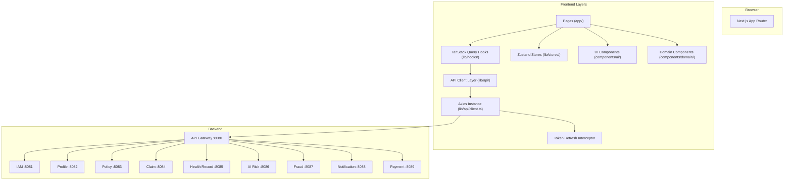
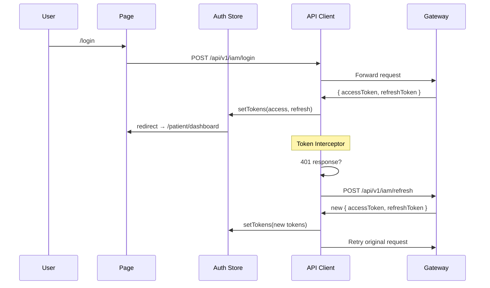

# SaglamOL Frontend — Arxitektura və Struktur Planı

> Backend-in **26 public controller**, **9 rol**, **90+ endpoint** üzərinə qurulub.
> Həm indiki (mock) vəziyyətə, həm də promptlardan sonrakı vəziyyətə uyğundur.

---

## Texnologiya Seçimi

| Texnologiya | Versiya | Səbəb |
|-------------|---------|-------|
| **Next.js** | 15.x (App Router) | SSR/SSG, file-based routing, API route proxy |
| **TypeScript** | 5.x | Type safety, backend DTO-larla 1:1 uyğunluq |
| **Zustand** | 5.x | Yüngül state management (auth, theme, sidebar) |
| **TanStack Query** | 5.x | Server state (caching, refetch, optimistic updates) |
| **Vanilla CSS** | — | Tam kontrol, design system tokens |
| **React Hook Form** | 7.x | Form validation (backend DTO-larla sinxron) |
| **Zod** | 3.x | Runtime schema validation |
| **Recharts** | 2.x | Dashboard charts |

---

## Rol → Portal Xəritəsi

Backend-dəki 9 rol 4 portala bölünür:

```
┌─────────────────────────────────────────────────┐
│              ROLLAR                PORTAL        │
├─────────────────────────────────────────────────┤
│  PATIENT                    →  Patient Portal   │
│  DOCTOR                     →  Hospital Portal  │
│  HOSPITAL_ADMIN             →  Hospital Portal  │
│  HOSPITAL_STAFF             →  Hospital Portal  │
│  INSURANCE_ADMIN            →  Insurance Portal │
│  INSURANCE_STAFF            →  Insurance Portal │
│  AGENT                      →  Insurance Portal │
│  ADMIN                      →  Admin Panel      │
│  SYSTEM (gələcək)           →  Admin Panel      │
├─────────────────────────────────────────────────┤
│  Giriş etməmiş (anonymous)  →  Public Pages     │
└─────────────────────────────────────────────────┘
```

---

## Qovluq Strukturu

```
saglamol-frontend/
├── public/
│   ├── favicon.ico
│   ├── logo.svg
│   └── images/
│       ├── hero-illustration.svg
│       └── empty-states/
│
├── src/
│   ├── app/                          # Next.js App Router
│   │   ├── (public)/                 # Anonymous layout group
│   │   │   ├── layout.tsx
│   │   │   ├── page.tsx              # Landing page
│   │   │   ├── login/
│   │   │   │   └── page.tsx
│   │   │   ├── register/
│   │   │   │   └── page.tsx
│   │   │   └── password-reset/
│   │   │       ├── request/
│   │   │       │   └── page.tsx
│   │   │       └── confirm/
│   │   │           └── page.tsx
│   │   │
│   │   ├── (portal)/                 # Authenticated layout group
│   │   │   ├── layout.tsx            # Sidebar + topbar + auth guard
│   │   │   │
│   │   │   ├── patient/              # ── PATIENT PORTAL ──
│   │   │   │   ├── layout.tsx
│   │   │   │   ├── dashboard/
│   │   │   │   │   └── page.tsx      # Polislərim, claim-lərim, bildirişlər
│   │   │   │   ├── profile/
│   │   │   │   │   └── page.tsx      # Patient profile create/edit
│   │   │   │   ├── policies/
│   │   │   │   │   ├── page.tsx      # GET /api/v1/policies/me
│   │   │   │   │   └── [id]/
│   │   │   │   │       └── page.tsx  # Policy detail + payments
│   │   │   │   ├── claims/
│   │   │   │   │   ├── page.tsx      # GET /api/v1/claims/my
│   │   │   │   │   ├── new/
│   │   │   │   │   │   └── page.tsx  # Multi-step claim creation wizard
│   │   │   │   │   └── [id]/
│   │   │   │   │       └── page.tsx  # Claim detail + documents + status timeline
│   │   │   │   ├── health-records/
│   │   │   │   │   ├── page.tsx      # GET /api/v1/health-records/my
│   │   │   │   │   └── [id]/
│   │   │   │   │       └── page.tsx  # Record detail + treatments + documents
│   │   │   │   ├── payments/
│   │   │   │   │   └── page.tsx      # GET /api/v1/payments/my
│   │   │   │   ├── notifications/
│   │   │   │   │   └── page.tsx      # GET /notifications/my
│   │   │   │   └── settings/
│   │   │   │       └── page.tsx      # Şifrə dəyişmə
│   │   │   │
│   │   │   ├── hospital/             # ── HOSPITAL PORTAL ──
│   │   │   │   ├── layout.tsx
│   │   │   │   ├── dashboard/
│   │   │   │   │   └── page.tsx      # Claim-lər, həkimlər, fraud xülasəsi
│   │   │   │   ├── claims/
│   │   │   │   │   ├── page.tsx      # Search claims (hospitalId scope)
│   │   │   │   │   ├── new/
│   │   │   │   │   │   └── page.tsx  # Staff creates claim for patient
│   │   │   │   │   └── [id]/
│   │   │   │   │       └── page.tsx  # Claim detail + add documents
│   │   │   │   ├── health-records/
│   │   │   │   │   ├── page.tsx      # Hospital's health records
│   │   │   │   │   ├── new/
│   │   │   │   │   │   └── page.tsx  # Create health record
│   │   │   │   │   └── [id]/
│   │   │   │   │       ├── page.tsx  # Record detail
│   │   │   │   │       └── treatment/
│   │   │   │   │           └── new/
│   │   │   │   │               └── page.tsx
│   │   │   │   ├── documents/
│   │   │   │   │   └── upload/
│   │   │   │   │       └── page.tsx  # MinIO presigned upload
│   │   │   │   ├── doctors/
│   │   │   │   │   └── page.tsx      # GET /{hospitalId}/doctors
│   │   │   │   ├── staff/
│   │   │   │   │   └── page.tsx      # Hospital staff management
│   │   │   │   └── branches/
│   │   │   │       └── page.tsx      # Hospital branch management
│   │   │   │
│   │   │   ├── insurance/            # ── INSURANCE PORTAL ──
│   │   │   │   ├── layout.tsx
│   │   │   │   ├── dashboard/
│   │   │   │   │   └── page.tsx      # KPIs, claim pipeline, fraud stats
│   │   │   │   ├── claims/
│   │   │   │   │   ├── page.tsx      # Search claims (companyId scope)
│   │   │   │   │   └── [id]/
│   │   │   │   │       ├── page.tsx  # Claim detail
│   │   │   │   │       └── review/
│   │   │   │   │           └── page.tsx  # Review: approve/reject/more-docs
│   │   │   │   ├── policies/
│   │   │   │   │   ├── page.tsx      # Search policies (company scope)
│   │   │   │   │   ├── issue/
│   │   │   │   │   │   └── page.tsx  # Issue new policy
│   │   │   │   │   └── [id]/
│   │   │   │   │       └── page.tsx  # Policy detail + cancel/suspend
│   │   │   │   ├── products/
│   │   │   │   │   ├── page.tsx      # Insurance products list
│   │   │   │   │   ├── new/
│   │   │   │   │   │   └── page.tsx  # Create product
│   │   │   │   │   └── [id]/
│   │   │   │   │       ├── page.tsx  # Product detail + coverage rules
│   │   │   │   │       └── coverage-rules/
│   │   │   │   │           └── page.tsx
│   │   │   │   ├── payments/
│   │   │   │   │   ├── page.tsx      # GET /payments/by-company
│   │   │   │   │   └── payout/
│   │   │   │   │       └── new/
│   │   │   │   │           └── page.tsx  # Manual claim payout
│   │   │   │   ├── invoices/
│   │   │   │   │   ├── page.tsx      # GET /invoices/by-company
│   │   │   │   │   └── [id]/
│   │   │   │   │       └── page.tsx  # Invoice detail
│   │   │   │   ├── fraud/
│   │   │   │   │   ├── page.tsx      # Company fraud summary
│   │   │   │   │   └── [claimId]/
│   │   │   │   │       └── page.tsx  # Fraud assessment detail + signals
│   │   │   │   ├── risk/
│   │   │   │   │   └── [claimId]/
│   │   │   │   │       └── page.tsx  # AI risk assessment detail
│   │   │   │   ├── contracts/
│   │   │   │   │   ├── page.tsx      # Provider contracts
│   │   │   │   │   └── new/
│   │   │   │   │       └── page.tsx  # Create contract
│   │   │   │   ├── staff/
│   │   │   │   │   └── page.tsx      # Company staff management
│   │   │   │   ├── agents/
│   │   │   │   │   └── page.tsx      # Agent profiles by company
│   │   │   │   └── company/
│   │   │   │       └── page.tsx      # Company profile settings
│   │   │   │
│   │   │   └── admin/                # ── ADMIN PANEL ──
│   │   │       ├── layout.tsx
│   │   │       ├── dashboard/
│   │   │       │   └── page.tsx      # System-wide KPIs
│   │   │       ├── users/
│   │   │       │   ├── page.tsx      # GET /api/v1/iam/users
│   │   │       │   └── [id]/
│   │   │       │       └── page.tsx  # User detail + role assign/remove
│   │   │       ├── companies/
│   │   │       │   ├── page.tsx      # All insurance companies
│   │   │       │   └── [id]/
│   │   │       │       └── page.tsx  # Company detail + status change
│   │   │       ├── hospitals/
│   │   │       │   ├── page.tsx      # All hospitals
│   │   │       │   └── [id]/
│   │   │       │       └── page.tsx  # Hospital detail
│   │   │       ├── patients/
│   │   │       │   └── page.tsx      # Search patients
│   │   │       └── notifications/
│   │   │           └── templates/
│   │   │               └── page.tsx  # Notification template management
│   │   │
│   │   ├── api/                      # Next.js API Routes (BFF proxy)
│   │   │   └── proxy/
│   │   │       └── [...path]/
│   │   │           └── route.ts      # Proxy to Gateway :8080
│   │   │
│   │   ├── layout.tsx                # Root layout (fonts, providers)
│   │   ├── not-found.tsx
│   │   └── error.tsx
│   │
│   ├── lib/                          # Core utilities
│   │   ├── api/                      # API client layer
│   │   │   ├── client.ts             # Axios instance (baseURL, interceptors)
│   │   │   ├── auth.ts               # Token refresh interceptor
│   │   │   ├── types.ts              # Generic: Page<T>, ErrorResponse
│   │   │   │
│   │   │   ├── iam.api.ts            # /api/v1/iam/*
│   │   │   ├── password.api.ts       # /api/v1/iam/password/*
│   │   │   ├── user-management.api.ts # /api/v1/iam/users/*
│   │   │   ├── profiles.api.ts       # /api/v1/profiles/*
│   │   │   ├── hospitals.api.ts      # /api/v1/profiles/hospitals/*
│   │   │   ├── insurance-companies.api.ts # /api/v1/insurance-companies/*
│   │   │   ├── policies.api.ts       # /api/v1/policies/*
│   │   │   ├── insurance-products.api.ts  # /api/v1/insurance-products/*
│   │   │   ├── coverage-rules.api.ts # /api/v1/insurance-products/{id}/coverage-rules/*
│   │   │   ├── provider-contracts.api.ts  # /api/v1/provider-contracts/*
│   │   │   ├── claims.api.ts         # /api/v1/claims/*
│   │   │   ├── claim-review.api.ts   # /api/v1/claims/{id}/review/*
│   │   │   ├── health-records.api.ts # /api/v1/health-records/*
│   │   │   ├── documents.api.ts      # /api/v1/health-records/{id}/documents/*
│   │   │   ├── payments.api.ts       # /api/v1/payments/*
│   │   │   ├── invoices.api.ts       # /api/v1/invoices/*
│   │   │   ├── notifications.api.ts  # /notifications/*
│   │   │   ├── fraud.api.ts          # /fraud/*
│   │   │   └── ai-risk.api.ts        # /ai-risk/*
│   │   │
│   │   ├── hooks/                    # TanStack Query hooks
│   │   │   ├── use-auth.ts
│   │   │   ├── use-profile.ts
│   │   │   ├── use-policies.ts
│   │   │   ├── use-claims.ts
│   │   │   ├── use-health-records.ts
│   │   │   ├── use-payments.ts
│   │   │   ├── use-invoices.ts
│   │   │   ├── use-notifications.ts
│   │   │   ├── use-insurance-products.ts
│   │   │   ├── use-fraud.ts
│   │   │   ├── use-ai-risk.ts
│   │   │   ├── use-hospitals.ts
│   │   │   ├── use-companies.ts
│   │   │   ├── use-contracts.ts
│   │   │   └── use-users.ts
│   │   │
│   │   ├── stores/                   # Zustand stores
│   │   │   ├── auth.store.ts         # accessToken, refreshToken, user, roles
│   │   │   ├── theme.store.ts        # dark/light mode
│   │   │   └── sidebar.store.ts      # collapsed state
│   │   │
│   │   ├── schemas/                  # Zod validation schemas
│   │   │   ├── auth.schema.ts        # LoginRequest, RegisterRequest
│   │   │   ├── claim.schema.ts       # CreateClaimRequest, ClaimItemRequest
│   │   │   ├── policy.schema.ts      # IssuePolicyRequest, EligibilityCheckRequest
│   │   │   ├── profile.schema.ts     # UpsertPatientProfileRequest, etc.
│   │   │   ├── payment.schema.ts     # CreatePolicyPremiumPaymentRequest
│   │   │   └── health-record.schema.ts
│   │   │
│   │   ├── guards/                   # Auth & role guards
│   │   │   ├── auth-guard.tsx        # Redirect to /login if unauthenticated
│   │   │   ├── role-guard.tsx        # Redirect if missing required role
│   │   │   └── portal-redirect.tsx   # Role → correct portal redirect
│   │   │
│   │   └── utils/
│   │       ├── constants.ts          # Role names, status enums, routes
│   │       ├── format.ts             # Currency, date, phone formatters
│   │       ├── claim-status.ts       # Status → color/icon/label mapper
│   │       ├── policy-status.ts      # Status → color/icon/label mapper
│   │       └── cn.ts                 # className merger utility
│   │
│   ├── components/                   # Reusable UI components
│   │   ├── layout/
│   │   │   ├── Sidebar.tsx           # Collapsible sidebar (role-aware navigation)
│   │   │   ├── Topbar.tsx            # User avatar, notifications bell, search
│   │   │   ├── Footer.tsx
│   │   │   ├── MobileNav.tsx
│   │   │   └── BreadcrumbNav.tsx
│   │   │
│   │   ├── ui/                       # Atomic design components
│   │   │   ├── Button.tsx
│   │   │   ├── Input.tsx
│   │   │   ├── Select.tsx
│   │   │   ├── TextArea.tsx
│   │   │   ├── Modal.tsx
│   │   │   ├── Drawer.tsx
│   │   │   ├── Toast.tsx
│   │   │   ├── Badge.tsx             # Status badges (claim, policy, payment)
│   │   │   ├── Card.tsx
│   │   │   ├── DataTable.tsx         # Paginated, sortable, filterable table
│   │   │   ├── Pagination.tsx
│   │   │   ├── Skeleton.tsx
│   │   │   ├── EmptyState.tsx
│   │   │   ├── ErrorBoundary.tsx
│   │   │   ├── Spinner.tsx
│   │   │   ├── Avatar.tsx
│   │   │   ├── Tabs.tsx
│   │   │   ├── Tooltip.tsx
│   │   │   ├── DropdownMenu.tsx
│   │   │   ├── FileUpload.tsx        # MinIO presigned URL upload
│   │   │   ├── ConfirmDialog.tsx
│   │   │   └── SearchInput.tsx
│   │   │
│   │   ├── domain/                   # Domain-specific components
│   │   │   ├── claim/
│   │   │   │   ├── ClaimStatusTimeline.tsx    # Visual status history
│   │   │   │   ├── ClaimStatusBadge.tsx       # Color-coded status
│   │   │   │   ├── ClaimItemsTable.tsx        # Claim line items
│   │   │   │   ├── ClaimDocumentList.tsx      # Attached documents
│   │   │   │   ├── ClaimCreationWizard.tsx    # Multi-step form
│   │   │   │   ├── ClaimReviewPanel.tsx       # Approve/reject/more-docs
│   │   │   │   ├── ClaimFraudBanner.tsx       # Fraud score warning
│   │   │   │   └── ClaimRiskBanner.tsx        # AI risk score display
│   │   │   │
│   │   │   ├── policy/
│   │   │   │   ├── PolicyCard.tsx             # Policy summary card
│   │   │   │   ├── PolicyStatusBadge.tsx
│   │   │   │   ├── PolicyLimitGauge.tsx       # Available/used/reserved visual
│   │   │   │   ├── EligibilityCheckForm.tsx
│   │   │   │   └── IssuePolicyForm.tsx
│   │   │   │
│   │   │   ├── payment/
│   │   │   │   ├── PaymentStatusBadge.tsx
│   │   │   │   ├── PaymentTimeline.tsx        # Transaction history
│   │   │   │   ├── PremiumPaymentForm.tsx
│   │   │   │   └── PayoutForm.tsx
│   │   │   │
│   │   │   ├── health-record/
│   │   │   │   ├── HealthRecordCard.tsx
│   │   │   │   ├── TreatmentList.tsx
│   │   │   │   ├── DocumentUploader.tsx       # MinIO presigned URL
│   │   │   │   └── DocumentViewer.tsx
│   │   │   │
│   │   │   ├── fraud/
│   │   │   │   ├── FraudScoreGauge.tsx        # Radial chart
│   │   │   │   ├── FraudSignalList.tsx        # Scored signals list
│   │   │   │   └── FraudSummaryCard.tsx
│   │   │   │
│   │   │   ├── notification/
│   │   │   │   ├── NotificationBell.tsx       # Topbar bell with count
│   │   │   │   ├── NotificationList.tsx
│   │   │   │   └── NotificationItem.tsx
│   │   │   │
│   │   │   └── dashboard/
│   │   │       ├── StatCard.tsx               # KPI card (icon, value, trend)
│   │   │       ├── ClaimPipelineChart.tsx      # Claim status distribution
│   │   │       ├── RevenueChart.tsx            # Premium income chart
│   │   │       ├── FraudHeatmap.tsx            # Fraud by hospital/doctor
│   │   │       └── RecentActivityFeed.tsx
│   │   │
│   │   └── forms/                    # Shared form components
│   │       ├── FormField.tsx
│   │       ├── FormError.tsx
│   │       ├── FormActions.tsx
│   │       └── DateRangePicker.tsx
│   │
│   └── styles/
│       ├── globals.css               # CSS reset, design tokens, base styles
│       ├── variables.css             # CSS custom properties (colors, spacing)
│       ├── layout.css                # Sidebar, topbar, page layout
│       ├── components.css            # Component-level styles
│       └── utilities.css             # Helper classes
│
├── .env.local                        # NEXT_PUBLIC_API_URL=http://localhost:8080
├── .env.example
├── next.config.ts
├── tsconfig.json
├── package.json
└── README.md
```

---

## Arxitektura Diaqramı



---

## Auth Axını



---

## API Client Nümunəsi

```typescript
// src/lib/api/client.ts
import axios from 'axios';
import { useAuthStore } from '@/lib/stores/auth.store';

const apiClient = axios.create({
  baseURL: process.env.NEXT_PUBLIC_API_URL || 'http://localhost:8080',
  headers: { 'Content-Type': 'application/json' },
});

// Request: Token əlavə et
apiClient.interceptors.request.use((config) => {
  const token = useAuthStore.getState().accessToken;
  if (token) config.headers.Authorization = `Bearer ${token}`;
  return config;
});

// Response: 401 → Auto refresh
apiClient.interceptors.response.use(
  (response) => response,
  async (error) => {
    if (error.response?.status === 401 && !error.config._retry) {
      error.config._retry = true;
      const refreshToken = useAuthStore.getState().refreshToken;
      if (!refreshToken) {
        useAuthStore.getState().logout();
        window.location.href = '/login';
        return Promise.reject(error);
      }
      try {
        const { data } = await axios.post(
          `${apiClient.defaults.baseURL}/api/v1/iam/refresh`,
          { refreshToken }
        );
        useAuthStore.getState().setTokens(data.accessToken, data.refreshToken);
        error.config.headers.Authorization = `Bearer ${data.accessToken}`;
        return apiClient(error.config);
      } catch {
        useAuthStore.getState().logout();
        window.location.href = '/login';
      }
    }
    return Promise.reject(error);
  }
);

export { apiClient };
```

```typescript
// src/lib/api/claims.api.ts
import { apiClient } from './client';
import type { Page, ClaimResponse, ClaimSummaryResponse,
  CreateClaimRequest, ClaimItemRequest } from './types';

export const claimsApi = {
  create: (data: CreateClaimRequest) =>
    apiClient.post<ClaimResponse>('/api/v1/claims', data),

  addItem: (claimId: string, data: ClaimItemRequest) =>
    apiClient.post<ClaimItemResponse>(`/api/v1/claims/${claimId}/items`, data),

  attachDocument: (claimId: string, data: AttachClaimDocumentRequest) =>
    apiClient.post(`/api/v1/claims/${claimId}/documents`, data),

  submit: (claimId: string) =>
    apiClient.post<ClaimResponse>(`/api/v1/claims/${claimId}/submit`),

  getById: (claimId: string) =>
    apiClient.get<ClaimResponse>(`/api/v1/claims/${claimId}`),

  getMyClaims: (page = 0, size = 20) =>
    apiClient.get<Page<ClaimSummaryResponse>>('/api/v1/claims/my', {
      params: { page, size },
    }),

  search: (filters: ClaimSearchFilters) =>
    apiClient.get<Page<ClaimSummaryResponse>>('/api/v1/claims', {
      params: filters,
    }),

  // ── Review endpoints (promptlardan sonra resubmit əlavə olunacaq) ──
  review: {
    start: (claimId: string) =>
      apiClient.post<ClaimResponse>(`/api/v1/claims/${claimId}/review/start`),

    approve: (claimId: string, data: ReviewClaimRequest) =>
      apiClient.post<ClaimResponse>(`/api/v1/claims/${claimId}/review/approve`, data),

    reject: (claimId: string, data: ReviewClaimRequest) =>
      apiClient.post<ClaimResponse>(`/api/v1/claims/${claimId}/review/reject`, data),

    requestMoreDocuments: (claimId: string, reason: string) =>
      apiClient.post<ClaimResponse>(
        `/api/v1/claims/${claimId}/review/more-documents`,
        null, { params: { reason } }
      ),

    cancel: (claimId: string, reason?: string) =>
      apiClient.put<ClaimResponse>(
        `/api/v1/claims/${claimId}/review/cancel`,
        null, { params: { reason } }
      ),

    // 🔮 Gələcək (P0-2 promptundan sonra):
    // resubmit: (claimId: string) =>
    //   apiClient.post<ClaimResponse>(`/api/v1/claims/${claimId}/resubmit`),

    // 🔮 Gələcək (P0-3 promptundan sonra):
    // retryPayout: (claimId: string) =>
    //   apiClient.post<ClaimResponse>(`/api/v1/claims/${claimId}/retry-payout`),
  },
};
```

---

## Portal → Backend Endpoint Xəritəsi

### Patient Portal

| Səhifə | Backend Endpoint | Metod |
|--------|------------------|-------|
| Dashboard | `/policies/me` + `/claims/my` + `/notifications/my` | GET |
| Profile | `/profiles/patients/me`, `/profiles/patients` | GET, POST, PUT |
| My Policies | `/policies/me` | GET |
| Policy Detail | `/policies/{id}` + `/payments/by-policy?policyId=` | GET |
| My Claims | `/claims/my` | GET |
| New Claim | `/claims` → `/claims/{id}/items` → `/claims/{id}/submit` | POST chain |
| Claim Detail | `/claims/{id}` + `/health-records/by-claim/{id}` | GET |
| My Health Records | `/health-records/my` | GET |
| My Payments | `/payments/my` | GET |
| Notifications | `/notifications/my` | GET |
| Change Password | `/iam/password/change` | POST |

### Hospital Portal

| Səhifə | Backend Endpoint | Metod |
|--------|------------------|-------|
| Dashboard | `/claims?hospitalId=` + `/fraud/hospitals/{id}/summary` | GET |
| Claims | `/claims?hospitalId=` | GET |
| New Claim | `/claims` (HOSPITAL_STAFF claim yaradır) | POST |
| Health Records | `/health-records` (hospital scope) | GET, POST |
| Add Treatment | `/health-records/{id}/treatments` | POST |
| Upload Document | `/health-records/{id}/documents` | POST |
| Doctors | `/profiles/hospitals/{id}/doctors` | GET |
| Staff | `/profiles/hospitals/{id}/staff` | GET, POST |
| Branches | `/profiles/hospitals/{id}/branches` | GET, POST |

### Insurance Portal

| Səhifə | Backend Endpoint | Metod |
|--------|------------------|-------|
| Dashboard | Multiple aggregation endpoints | GET |
| Claim Search | `/claims?companyId=` | GET |
| Claim Review | `/claims/{id}/review/start/approve/reject/more-documents` | POST |
| Policies | `/policies?companyId=` | GET |
| Issue Policy | `/policies` + `/policies/eligibility-check` | POST |
| Products | `/insurance-products?companyId=` | GET, POST, PUT |
| Coverage Rules | `/insurance-products/{id}/coverage-rules` | GET, POST |
| Payments | `/payments/by-company?companyId=` | GET |
| Manual Payout | `/payments/claim-payout` | POST |
| Invoices | `/invoices/by-company?companyId=` | GET, POST |
| Fraud Summary | `/fraud/companies/{id}/summary` | GET |
| Fraud Detail | `/fraud/claims/{claimId}` | GET |
| AI Risk | `/ai-risk/claims/{claimId}` | GET |
| Contracts | `/provider-contracts/by-company/{id}` | GET, POST |
| Staff | `/insurance-companies/{id}/staff` | GET, POST |
| Agents | `/profiles/agents/by-company/{id}` | GET |
| Company Profile | `/insurance-companies/{id}` | GET, PUT |

### Admin Panel

| Səhifə | Backend Endpoint | Metod |
|--------|------------------|-------|
| Users | `/iam/users`, `/iam/users/search?q=` | GET |
| User Detail | `/iam/users/{id}`, `/iam/users/{id}/roles`, `/iam/users/{id}/status` | GET, POST, PATCH, DELETE |
| Companies | `/insurance-companies` | GET, POST |
| Hospitals | `/profiles/hospitals` | GET, POST |
| Patients Search | `/profiles/patients/search` | GET |
| Notification Templates | `/notifications/templates` | GET, POST |

---

## Gələcək Uyğunluğu (Promptlardan Sonra)

Aşağıdakılar frontend-də **hazır yer saxlanılıb**, backend promptları icra edildikdə açılacaq:

| Backend Prompt | Frontend Təsiri | Hazır? |
|----------------|----------------|--------|
| **P0-2** NEEDS_MORE_DOCUMENTS resubmit | `ClaimReviewPanel.tsx`-ə "Yenidən göndər" buttonu | ✅ Placeholder var |
| **P0-3** PAYOUT_FAILED retry | `ClaimDetail` səhifəsinə "Ödənişi yenidən cəhd et" | ✅ Placeholder var |
| **P0-5** Fraud guard | `ClaimReviewPanel.tsx`-ə fraud check status göstərici | ✅ UI component var |
| **P0-6** Admin tenant isolation | Admin panelində company scope filter | ✅ Artıq var |
| **SEC-3** Brute-force | Login səhifəsində "Hesab kilidlənib" mesajı | ✅ Error mapping var |
| **P1-5** Policy expiry | Policy status badge-ə EXPIRED rəngi | ✅ Artıq var |
| **P2-1** Validation errors | Form error display-da field-level xəta | ✅ FormError component var |

---

## CSS Design Token-ları (Nümunə)

```css
/* src/styles/variables.css */
:root {
  /* ── Colors ── */
  --color-primary-50:  #eef2ff;
  --color-primary-100: #e0e7ff;
  --color-primary-500: #6366f1;
  --color-primary-600: #4f46e5;
  --color-primary-700: #4338ca;

  --color-success-500: #22c55e;
  --color-warning-500: #f59e0b;
  --color-danger-500:  #ef4444;
  --color-info-500:    #3b82f6;

  --color-neutral-50:  #fafafa;
  --color-neutral-100: #f5f5f5;
  --color-neutral-200: #e5e5e5;
  --color-neutral-700: #404040;
  --color-neutral-800: #262626;
  --color-neutral-900: #171717;

  /* ── Dark mode override ── */
  --bg-primary:    var(--color-neutral-50);
  --bg-secondary:  #ffffff;
  --bg-sidebar:    var(--color-neutral-900);
  --text-primary:  var(--color-neutral-900);
  --text-secondary: var(--color-neutral-700);
  --border-color:  var(--color-neutral-200);

  /* ── Typography ── */
  --font-sans: 'Inter', system-ui, sans-serif;
  --font-mono: 'JetBrains Mono', monospace;
  
  --text-xs:   0.75rem;
  --text-sm:   0.875rem;
  --text-base: 1rem;
  --text-lg:   1.125rem;
  --text-xl:   1.25rem;
  --text-2xl:  1.5rem;
  --text-3xl:  1.875rem;

  /* ── Spacing ── */
  --space-1: 0.25rem;
  --space-2: 0.5rem;
  --space-3: 0.75rem;
  --space-4: 1rem;
  --space-6: 1.5rem;
  --space-8: 2rem;

  /* ── Radius ── */
  --radius-sm: 0.375rem;
  --radius-md: 0.5rem;
  --radius-lg: 0.75rem;
  --radius-xl: 1rem;
  --radius-full: 9999px;

  /* ── Shadows ── */
  --shadow-sm:  0 1px 2px rgba(0,0,0,0.05);
  --shadow-md:  0 4px 6px -1px rgba(0,0,0,0.1);
  --shadow-lg:  0 10px 15px -3px rgba(0,0,0,0.1);
  --shadow-xl:  0 20px 25px -5px rgba(0,0,0,0.1);

  /* ── Layout ── */
  --sidebar-width: 260px;
  --sidebar-collapsed: 72px;
  --topbar-height: 64px;

  /* ── Transitions ── */
  --transition-fast: 150ms cubic-bezier(0.4, 0, 0.2, 1);
  --transition-base: 250ms cubic-bezier(0.4, 0, 0.2, 1);
}

[data-theme="dark"] {
  --bg-primary:    var(--color-neutral-900);
  --bg-secondary:  var(--color-neutral-800);
  --bg-sidebar:    #0a0a0a;
  --text-primary:  var(--color-neutral-50);
  --text-secondary: var(--color-neutral-200);
  --border-color:  var(--color-neutral-700);
}
```

---

## Mərhələli İnkişaf Planı

### Faza 1 — Skelet (1 həftə)
- [ ] Next.js init + TypeScript + ESLint
- [ ] CSS design system (variables.css, globals.css)
- [ ] Layout components (Sidebar, Topbar, MobileNav)
- [ ] Auth flow (login, register, token refresh)
- [ ] Auth store (Zustand) + Auth guard
- [ ] API client + interceptors
- [ ] Portal redirect (role → correct portal)

### Faza 2 — Patient Portal (2 həftə)
- [ ] Dashboard (policy count, claim count, notifications)
- [ ] Profile creation/edit
- [ ] My Policies list + detail
- [ ] Claims list + multi-step creation wizard + detail with status timeline
- [ ] Health Records list + detail
- [ ] My Payments
- [ ] Notifications
- [ ] Password change

### Faza 3 — Insurance Portal (2 həftə)
- [ ] Dashboard (KPIs, claim pipeline chart, fraud stats)
- [ ] Claim search + review panel (approve/reject/more-docs)
- [ ] Policy search + issue + detail (cancel/suspend)
- [ ] Insurance products + coverage rules
- [ ] Payments by company + manual payout
- [ ] Invoices
- [ ] Fraud summary + detail
- [ ] Provider contracts
- [ ] Company staff + agents

### Faza 4 — Hospital Portal (1.5 həftə)
- [ ] Dashboard
- [ ] Claims (hospital scope) + create claim for patient
- [ ] Health records + treatments
- [ ] Document upload (MinIO presigned URL)
- [ ] Doctors, staff, branches

### Faza 5 — Admin Panel (1 həftə)
- [ ] User management (list, search, role assign/remove, status)
- [ ] Insurance company management
- [ ] Hospital management
- [ ] Patient search
- [ ] Notification templates

### Faza 6 — Polish (1 həftə)
- [ ] Dark mode
- [ ] Responsive design (mobile/tablet)
- [ ] Micro-animations
- [ ] Loading skeletons
- [ ] Empty states
- [ ] Error boundaries
- [ ] SEO (meta tags, OG)
- [ ] Performance audit (lazy loading, code splitting)

---

## Açıq Suallar

> [!IMPORTANT]
> Aşağıdakı suallar frontend tətbiqi yaratmazdan əvvəl cavablandırılmalıdır:

1. **Dil**: Frontend Azərbaycan dilində, İngilis dilində, yoxsa çoxdilli (i18n) olmalıdır?
2. **Hosting**: Vercel, Docker, static export — hansı deployment strategiyası?
3. **Real-time**: Bildirişlər üçün WebSocket/SSE lazımdırmı, yoxsa polling kifayətdir?
4. **Fayl yeri**: Frontend backend mono-repo-nun içində olmalıdır (`saglamol-frontend/` qovluğu), yoxsa ayrıca repo?
